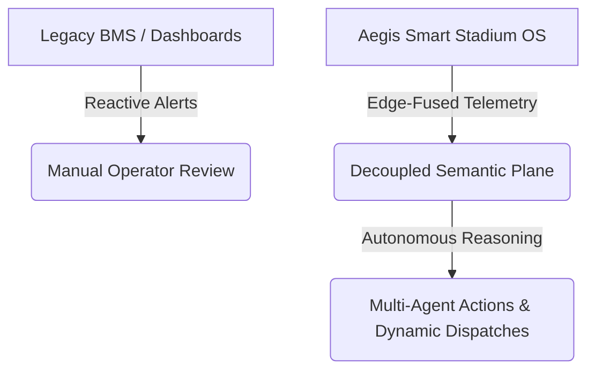
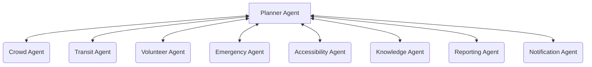
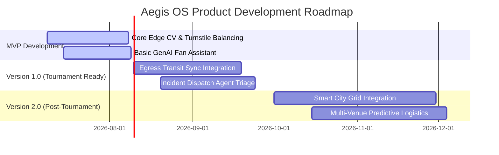

# Aegis Smart Stadium OS: Single Source of Truth
## Document Metadata
* **Version:** 1.1
* **Approval Status:** APPROVED (Executive Product Board)
* **Document Owner:** Executive Product Board (CEO, CPO, Principal PM, Technical Architects)
* **Last Updated:** 2026-07-08
* **Dependencies:** None (This is the parent constitution)
* **Future Documents Depending on this File:** Product Requirement Documents (PRDs), Product Design Documents (PDDs), Technical Architecture Designs, Database Schemas, API Specifications, UI/UX Guidelines, QA Testing Plans.

## Version History
* **v1.0 (2026-07-08):** Initial approved draft establishing core architecture, modules, boundaries, and rules.
* **v1.1 (2026-07-08):** Strategic extension incorporating product differentiation, match day journeys, user journeys, AI agent ecosystem, demo story, MoSCoW prioritization, competitive advantage, and success scenarios.

---

# 1. Executive Summary

Aegis Smart Stadium OS is the flagship Tournament Operations and Smart Stadium intelligence platform designed specifically for the FIFA World Cup 2026. The 2026 tournament represents an unprecedented logistical challenge: 48 teams, 104 matches, and over 6 million in-person fans across 16 host cities in three sovereign nations (US, Canada, and Mexico). Coordinating this massive event from the centralized Tournament Operations Center (TOC) in Miami requires harmonizing cross-border logistics, disparate municipal transit systems, varying law enforcement protocols, and extreme summer climates.

Aegis OS is engineered as a **Hybrid AI Platform** that bridges the gap between massive streams of physical/operational telemetry and real-time human decision-making. By deploying low-latency edge-computing nodes running optimized computer vision at the stadium perimeters and coordinating them with a cloud-based multi-agent reasoning layer, Aegis OS translates raw, unstructured data (CCTV feeds, acoustic nodes, transit APIs, and sensor telemetry) into structured, actionable operations.

The platform is structured around five core operational flagships:
1. **Turnstile Crowd Surge Mitigation:** Edge computer vision dynamically monitors entry queues, proactively balancing spectator distribution across gates to prevent perimeter crushing.
2. **Post-Match Egress & Public Transit Sync:** A multi-agent engine coordinates exit gates and turnstile flows with municipal rail and bus networks in real-time, preventing platform overcrowding.
3. **Security Incident Response Dispatch:** An agentic triage loop processes CCTV and acoustic anomalies to automatically generate incident briefs and dispatch the closest qualified stewards.
4. **GenAI Fan Concierge & Support:** A multilingual conversational assistant that integrates ticketing, map routing, concessions, and transit telemetry to provide real-time, context-aware navigational support.
5. **VIP Hospitality Personalization:** A secure, opt-in facial recognition and profiling engine that delivers real-time briefings to suite hosts, optimizing commercial returns.

Aegis OS serves as the single source of truth and operational constitution, establishing the boundaries, success metrics, AI strategy, and non-negotiable rules for all subsequent design, development, and testing phases.

---

# 2. Product Identity

* **Official Project Name:** Aegis Smart Stadium OS (Aegis OS / Aegis WC-SIP)
* **Tagline:** Orchestrating safe, seamless, and sustainable tournament operations through edge-fused intelligence.
* **Vision Statement:** To pioneer the next generation of mega-event operations, turning physical stadiums into responsive, intelligent, and safe ecosystems that elevate the human experience.
* **Mission Statement:** To deploy high-frequency sensor fusion, edge computing, and multi-agent AI to synchronize crowd safety, transit networks, and steward response across all 16 host cities of the FIFA World Cup 2026.
* **One Sentence Pitch:** Aegis OS is a hybrid edge-to-cloud AI platform that fuses real-time computer vision, transit telemetry, and multi-agent reasoning to automate crowd safety, security dispatch, and personalized fan logistics for the FIFA World Cup 2026.
* **30 Second Pitch:** Hosting the World Cup across three countries introduces severe operational complexity. Aegis OS resolves this by integrating localized edge computer vision with a cloud-based multi-agent coordinator. The platform monitors entry perimeters to prevent crushes, coordinates post-match stadium exits directly with city transit schedules, and automates emergency dispatching. By converting unstructured venue feeds into real-time directions and staff briefings, Aegis OS guarantees a secure, accessible, and high-performance matchday experience.
* **2 Minute Pitch:** Major sports stadiums are temporary smart cities, but traditional operations remain siloed and reactive, leading to queue gridlocks, transit platform crowding, and delayed emergency response. The expanded 2026 FIFA World Cup, with 104 matches across 16 cities, amplifies these risks. 

  Aegis OS is a comprehensive Smart Stadium Operating System. Our architecture utilizes a Hybrid AI design: on-site edge nodes run lightweight computer vision models to track entry gate densities and incident signatures under a 20ms latency budget. These edge nodes serialize spatial metrics and publish them to a secure event bus. In the cloud, a multi-agent network retrieves this data, cross-references it with city transit APIs, and coordinates actions.
  
  During ingress, Aegis OS dynamically redirects fans to underutilized turnstiles. During egress, it gates exits to match incoming train capacities, protecting municipal platforms from crowd crushes. If an incident occurs, the system triages video and acoustic data, writes an automated log, and routes the closest steward. For fans, an omniscient GenAI assistant offers multilingual navigation. Aegis OS maximizes venue security, guarantees accessibility compliance, and protects commercial investments, establishing the permanent blueprint for modern mega-events.
* **Core Philosophy:**
  * **Aesthetics of Safety:** Security and crowd management must operate seamlessly and invisibly without compromising the fan experience.
  * **Decoupled Architecture:** Millisecond-level safety and edge classification loops must operate independently of high-latency semantic reasoning models.
  * **Human Oversight (HITL):** AI provides predictive options and automates routing, but human commanders retain ultimate veto and override authority.
  * **Privacy-by-Design:** Personal identity and raw video feeds must be processed and discarded at the local edge node, ensuring complete regulatory compliance.

---

# 3. Product Differentiation

Aegis Smart Stadium OS represents a fundamental architectural shift from historical venue platforms:



* **Aegis OS vs. IBM Intelligent Operations Center:** IBM relies on standard database structures and retrospective analytical graphs, requiring human analysts to parse data. Aegis OS utilizes an active semantic knowledge plane and a multi-agent network that interprets unstructured text, voice, and video to execute dispatches autonomously.
* **Aegis OS vs. Cisco Spaces / Connected Wi-Fi:** Cisco Spaces tracks MAC address coordinates to report bottlenecks after they form. Aegis OS combines edge computer vision with spatial-temporal diffusion models to predict crowd accumulations 60 minutes before they occur, dynamically pushing personalized routing alerts to user devices.
* **Aegis OS vs. Honeywell / Siemens BMS:** Traditional building management systems use deterministic scripts to regulate HVAC and lighting in isolation. Aegis OS links microclimate control to real-time seating bowl occupancy heatmaps, transit APIs, and weather telemetry, coordinating building parameters with dynamic event schedules.
* **Why Aegis is Different:** Rather than presenting operations teams with another complex dashboard, Aegis OS focuses on **GenAI Reasoning**. It listens to multi-lingual radio chatter, cross-references logs with digitised venue SOPs, drafts incident logs, and updates accessible routes for disabled fans conversational interfaces. Aegis OS is an active operator, not a passive monitor.

---

# 4. Challenge Alignment

Aegis OS is designed to address the core objectives of the Smart Stadiums & Tournament Operations Challenge:

* **Stadium Operations:** Synthesizes isolated systems (ticketing, POS, CCTV, BMS, and HVAC) into a single operational interface, transitioning facilities management from reactive sweeps to predictive maintenance and dynamic load balancing.
* **Fan Experience:** Eliminates friction points (concession wait times, transit delays, confusing wayfinding) by providing real-time, context-aware navigational alerts and digital concierge support.
* **Accessibility:** Leverages spatial-temporal twins and dynamic routing to guarantee that disabled, elderly, and neurodivergent fans receive real-time, voice-guided navigation that adapts around physical obstacles and crowd bottlenecks.
* **Sustainability:** Syncs match egress directly with low-emission municipal transit, coordinates HVAC and lighting outputs based on seating bowl occupancy heatmaps, and uses computer vision to guide sorting at recycling stations.
* **Transportation:** Eliminates "last-mile" gridlock by integrating rideshare geofencing, smart parking metrics, and real-time municipal train/bus telemetry into a unified coordination dashboard.
* **Crowd Management:** Prevents crowd crushing and perimeter gate breaches by continuously tracking crowd densities, velocity, and sentiment, executing proactive gating and routing protocols.
* **Operational Intelligence:** Replaces static dashboards with an event-driven semantic knowledge plane, enabling centralized command center operators to interact with multi-venue environments via natural-language tactical queries.
* **Decision Support:** Provides automated incident logs, dynamic response options, and transit sync pacing calculations, reducing the cognitive load on tournament coordinators under high-pressure scenarios.

---

# 5. Problem Statement

### Primary Problem
Mega-event stadium operations are critically siloed. Physical security, crowd management, concessions, local transport, and emergency services operate on disparate, legacy systems. When 80,000+ spectators converge on a venue, this lack of coordination causes operational bottlenecks, transit gridlock, and security vulnerabilities that standard software cannot solve and human operators cannot coordinate in real-time.

### Secondary Problems & Pain Points
1. **Multilingual Crisis & Wayfinding Failures:** Standard signage and pre-recorded alerts fail to communicate safety directions to a diverse fan base speaking 40+ languages, leading to localized panic during incidents.
2. **Post-Match Egress Congestion:** Simultaneous crowd departure overwhelms transit stations, generating high-density platform crush hazards.
3. **Medical Emergency Delays:** Packed seating bowls and corridor crowd density hinder response times, preventing medical teams from locating and triaging acute cases.
4. **Turnstile queue bottlenecks:** Delayed bag checks and ticket validation create crowd pressure outside perimeters, increasing crushing risk.
5. **Accessibility Barriers:** Mobility-impaired fans are isolated by uncoordinated routing, elevator outages, and steep stadium layouts.
6. **Information Overload:** Command center operators are overwhelmed by thousands of raw video feeds and sensor alerts, causing cognitive fatigue.

### Why Existing Solutions Fail
Current industry platforms (e.g., standard BMS, passive video analytics, or simple chat widgets) operate reactively. They flag problems after they occur (e.g., reporting a crowd surge after the gate is blocked) and lack the integration to coordinate across separate domains (e.g., adjusting turnstile flow based on train arrival schedules).

---

# 6. Target Users

| User Category | Persona / Role | Goals | Primary Responsibilities | Core Pain Points | Success Metrics |
| :--- | :--- | :--- | :--- | :--- | :--- |
| **Primary** | **SOC Directors & Incident Commanders** | Zero critical safety failures; rapid, coordinated response to emergencies. | Oversee venue safety, coordinate emergency services, authorize evacuations. | Information overload, jammed radio channels, delayed situational reports. | Incident resolution time < 3 mins; 100% data coordination. |
| **Primary** | **Security & Ground Stewards** | Safe crowd distribution; immediate de-escalation of disputes. | Perform searches, manage queue stanchions, resolve seating conflicts. | High crowd hostility, lack of location routing, language barriers. | Queue wait times < 10 mins; zero gate breaches. |
| **Secondary** | **Spectators & Fans (General & Disabled)** | Safe, friction-free matchday experience; clear navigation. | Access ticketing, navigate perimeters, find seating and amenities. | Long queues, connectivity blackouts, confusing accessible routes. | Egress transit time < 30 mins; fan satisfaction score > 95%. |
| **Secondary** | **Municipal Transit Dispatchers** | Smooth urban dispersal; prevent transit platform overcrowding. | Coordinate rail/bus fleets, adjust traffic signals. | Sudden crowd surges, lack of egress velocity data. | Station platform density < 3 p/m²; optimal vehicle utilization. |
| **Tertiary** | **VIP/VVIP Suite Hosts** | Deliver premium, high-value personalized service. | Manage suite arrivals, catering preferences, and VIP safety. | Disjointed guest tracking, last-minute dietary requests. | Upsell fulfillment rates; VVIP retention score. |
| **Tertiary** | **Facilities & Cleaning Managers** | Fast venue turnaround; high waste sorting compliance. | Clean seating bowls, restock washrooms, repair assets. | Waste contamination, untracked asset damage. | Turnaround time < 24 hours; eco-diversion rate > 90%. |

---

# 7. Match Day Journey

The operational timeline of Aegis Smart Stadium OS spans a continuous 24-hour cycle:

```
[06:00] Operations Initialization ──> [07:00] Staff Login & Self-Test ──> [08:00] AI Infrastructure Health Check
              │
              ▼
[09:00] Predictive Ingress Model ──> [10:00] Volunteer Allocation ──> [12:00] Gate Opening & Ingress Start
              │
              ▼
[13:00] Peak Crowd Entry & CV ──> [15:00] Kickoff & Match Ops ──> [15:45] Halftime Queue Balance
              │
              ▼
[16:15] Emergency Scenario (Triage) ──> [17:00] Match End & Egress ──> [17:30] Transit Sync Pacing
              │
              ▼
[18:30] Post-Match Sweeps & Reset ──> [22:00] Venue Lockdown & Report
```

* **06:00 – Operations Start & Initialization:** Aegis OS boots the local digital twin environment. The system retrieves external transit timetables, local weather forecasts, and historical crowd models to map baseline parameters.
* **07:00 – Staff Login & Multi-lingual Onboarding:** On-ground volunteers, security stewards, and medical responders log into the Aegis Staff App. The system maps their locations, language capabilities, and certifications.
* **08:00 – AI Infrastructure Health Check:** Aegis OS executes automated pings across the network. It verifies calibration parameters for all 16 roof-mounted tracking cameras, check status on WTMD metal detectors, edge computing nodes, and PTP network clocks.
* **09:00 – Predictive Ingress Modeling:** The system processes digital ticketing sales maps, projecting potential ingress bottlenecks based on target gate parameters and arrival times.
* **10:00 – Volunteer Dynamic Allocation:** Based on the predicted gate bottlenecks, Aegis OS negotiates volunteer assignments, routing wayfinders and ticket support teams to critical gates.
* **12:00 – Gate Opening & Perimeter Activation:** Outer and Inner perimeters open. Ticketing scanners and turnstiles begin streaming entry telemetry to the local event bus.
* **13:00 – Fan Arrival & Screening Surveillance:** Edge YOLO11 models process camera feeds at the outer security tents. The system monitors lane processing speeds and queue densities, alerting commanders to queue builds.
* **15:00 – Kickoff & Active Match Operations:** Match begins. Aegis OS coordinates HVAC grilles and localized cooling based on seating bowl occupancy heatmaps. The GenAI Fan Concierge responds to in-seat dining and wayfinding prompts.
* **15:45 – Halftime Concession Balancing:** Concourse cameras track queue lengths at food courts. Aegis OS sends localized app alerts to fans, nudging them to underutilized restroom zones and concession stands.
* **16:15 – Emergency Scenario (Medical/Security Incident):** A medical emergency is reported in the seating bowl. Aegis OS isolates the coordinates via CCTV, drafts a structured dispatch log, and routes the closest medic.
* **17:00 – Match End & Egress Initialization:** Egress gating begins. Exit gates widen, and the Egress Agent begins tracking fan crowd flow velocity toward transit stations.
* **17:30 – Transit Synchronization & Platform Pacing:** The system monitors local train arrivals. Egress gates adjust turnstile rotation speeds to match transit platform capacity, protecting public safety.
* **18:30 – Post-Match Sweeps & Venue Reset:** Cleaning crews log sweeps. Cameras map trash densities, routing sweepers to heavy volume zones and recycling bins.
* **22:00 – Venue Lockdown & Automated Reporting:** All systems secure. Aegis OS compiles the final operational brief, logs incident summaries, and transfers control to static facility management.

---

# 8. User Journeys

### A. The Spectator / Fan Journey
* **Ingress:** A fan arrives at the stadium precinct. The Aegis Fan App alerts them that their primary entry gate is experiencing a 15-minute delay, providing an alternate wheelchair-compliant gate route with a 2-minute wait.
* **In-Seat:** During the match, the fan uses the app to ask: *"Where can I get a cold drink with no line?"* The GenAI assistant checks POS transaction rates and routes them to a concession stand in the adjacent concourse block.
* **Egress:** At match end, the app provides a personalized transit guide: *"Your train is delayed by 10 minutes. Please remain in the Fan Zone area; we will notify you when to proceed to the gate."*

### B. The Volunteer Wayfinder Journey
* **Shift Setup:** A volunteer logs into their mobile client at 07:00. The app displays their station at Gate D, along with visual SOP guidelines for ticket scanning support.
* **Dynamic Reallocation:** At 13:30, the Volunteer Agent detects a ticket validation bottleneck at Gate F. The volunteer receives a priority notification: *"Gate F is experiencing high queue delays. Please redeploy to Gate F, Sector 3 to assist. Tap here for routing."*
* **Incident Escalation:** A fan reports a missing child to the volunteer. The volunteer inputs the details via voice prompt. Aegis OS processes the text, matches it to security, and pins the coordinates.

### C. The Security Steward Journey
* **Patrol Mode:** A steward patrols Concourse Level 2, with their GPS position and language capabilities tracked by the Volunteer Agent.
* **Incident Dispatch:** The steward receives a silent haptic alert on their smart-band: *"Intruder detection/verbal dispute in Block 204, Row 12. Proceed immediately via Stairs 4."*
* **Resolution Support:** The steward arrives, de-escalates the dispute, and confirms resolution via their app, which automatically updates the command log.

### E. The Accessibility User Journey
* **Arrival:** A disabled spectator in a wheelchair approaches the perimeter. The app maps a path that avoids stairs, routing them through Ramp B.
* **Dynamic Bypass:** An elevator on their planned path experiences a mechanical fault. The Accessibility Agent detects the fault, updates the spectator's routing: *"Elevator 4 is offline. Route recalculated via Elevator 5."*
* **Evacuation:** During an alert, the app provides step-by-step voice guidance to a dedicated wheelchair refuge area, notifying stewards of their exact location.

---

# 9. Product Scope

### What IS Included (Approved Modules)
* **Turnstile Ingress Load Balancer:** Real-time edge CV monitoring of queue lengths with proactive mobile redirection.
* **Post-Match Egress Transit Coordinator:** Multi-agent engine syncing exit gates with real-time transit telemetry.
* **Security Dispatch Coordinator:** Multi-modal anomaly detection with automated incident reports and steward routing.
* **GenAI Fan Concierge Mobile Client:** Multilingual conversational assistant for spatial navigation and ticketing.
* **VVIP Hospitality Personalization Suite:** Opt-in facial profile matching for personalized service delivery.
* **Smart Microclimate Control Bridge:** HVAC and cooling adjustments based on seat-occupancy and weather.
* **Volunteer Dynamic Allocation Engine:** Task negotiation based on proximity, skills, and corridor congestion.

### What is NOT Included (Explicitly Out of Scope)
* **Broad Public Transit Operation:** Aegis OS interfaces with transit APIs but does not control city trains or buses.
* **Primary Emergency Services Dispatch:** Local police, fire, and ambulance dispatch systems remain independent; Aegis OS provides coordination briefs.
* **Raw Database Hosting:** Financial transaction databases and ticketing registry hosts are external; Aegis OS interacts via secure APIs.

### Future Scope (Post-2026 Tournament)
* Integration with municipal smart-city grids for year-round venue event orchestration.
* Predictive retail logistics models for seasonal sports venues.

---

# 10. Product Principles

1. **Accessibility First:** Universal design is non-negotiable. Every user interface must support multi-modal outputs (audio, visual, haptic) and comply with WCAG 2.2 AA standards.
2. **AI Assists, Human Decides:** AI coordinates workflows and proposes routing, but critical commands (gate closure, evacuation, dispatch) require human validation.
3. **Decoupled Safety Loops:** High-speed edge computer vision and sensor fusion loops must operate under a 20ms latency budget, isolated from the cloud reasoning layer.
4. **Privacy-by-Design:** Raw video streams and personal biometric markers are processed locally at the edge and discarded. Only structured metadata is published to the cloud.
5. **Offline Graceful Degradation:** In the event of WAN network failure, edge nodes must fall back to local mesh communication, ensuring basic safety and entry operations continue.
6. **Operational Grounding:** All language models and agents are strictly grounded in verified database structures, rulebooks, and spatial maps, eliminating hallucinations.

---

# 11. AI Strategy

Aegis OS implements a Hybrid AI Architecture that balances high-speed edge processing with centralized multi-agent reasoning:

* **Large Language Models (LLM):** Ingests multi-agency radio logs, emergency dispatches, and user queries to generate structured incident briefs and conversational responses.
* **Retrieval-Augmented Generation (RAG):** Dynamically retrieves venue-specific emergency operating guidelines (SOPs) and safety protocols during incident triage.
* **Computer Vision (CV):** Runs YOLO11 and SAM2 models at the edge to calculate crowd density, flow velocity, queue lengths, and detect acoustic/visual anomalies.
* **Speech & Neural Audio:** Localized speech recognition for coaching/staff voice queries; neural speech synthesis for multilingual public address alerts.
* **Translation (NMT):** Translates dynamic alerts, navigational guidance, and medical triage text across 15+ target languages.
* **Predictive Modeling:** Forecasts crowd congestion points, transit queue wait times, and shuttle bus arrival distributions up to an hour in advance.
* **Maps & Homography:** Continuously maps 2D camera pixels to 3D LiDAR coordinates, enabling precise spatial tracking of crowds and assets.
* **Multi-Agent Coordination:** Coordinates task networks (Egress Agent, Transit Agent, Signage Agent) using FIPA ACL-structured messages to prevent execution loops.
* **Human-in-the-Loop (HITL):** Integrates validation prompts for critical actions, ensuring human operators retain complete operational control.

---

# 12. AI Agent Ecosystem

Aegis OS operates as a decoupled, multi-agent network where specialized agents collaborate via standard FIPA ACL communication envelopes:



### 1. Planner Agent
* **Responsibilities:** Acts as the central orchestrator, parsing user requests, building execution plans, and allocating tasks to specialized domain agents.
* **Inputs:** Natural-language prompts, API gateway requests, system event triggers.
* **Outputs:** Task delegation envelopes, final synthesized response objects.
* **Interactions:** Broadcasts CFP (Call For Proposals) requests to domain agents; validates bids.

### 2. Crowd Agent
* **Responsibilities:** Monitors perimeter and seating bowl densities, forecasting chokepoints and calculating flow velocities.
* **Inputs:** Edge YOLO11 coordinate streams, turnstile tick rates, optical crowd density metrics.
* **Outputs:** Density alerts, crowd congestion predictions, gating rate proposals.
* **Interactions:** Feeds spatial data to the Planner Agent; coordinates with Egress and Transit Agents.

### 3. Transit Agent
* **Responsibilities:** Tracks city public transit schedules, train arrivals, rideshare pick-up volumes, and municipal traffic lights.
* **Inputs:** City rail APIs, parking lot ultrasonic sensors, rideshare geofence alerts.
* **Outputs:** Train delay metrics, transit platform occupancy forecasts, transit sync pacing targets.
* **Interactions:** Collaborates with the Crowd Agent to pace exit gates; informs the Planner Agent.

### 4. Volunteer Agent
* **Responsibilities:** Manages volunteer and steward availability, language profiles, location tracking, and task allocations.
* **Inputs:** Volunteer app check-ins, steward GPS coordinates, gate bottleneck statuses.
* **Outputs:** Dynamic staffing proposals, step-by-step redirection dispatches.
* **Interactions:** Responds to Planner Agent requests; coordinates with the Crowd Agent for bottleneck mitigation.

### 5. Emergency Agent
* **Responsibilities:** Monitors alarms, fire panels, and acoustic/visual incident signatures to initiate safety protocols.
* **Inputs:** Fire panel alerts, acoustic glass-break/yell triggers, manual distress reports.
* **Outputs:** Evacuation plans, emergency alert templates, dynamic signage override alerts.
* **Interactions:** Direct line to the Planner Agent; commands the Notification Agent to broadcast emergency warnings.

### 6. Accessibility Agent
* **Responsibilities:** Monitors accessible pathways (elevators, ramps, corridors) and updates personalized routing for disabled users.
* **Inputs:** Elevator BMS status logs, crowd density blocks on ADA routes, user mobility profiles.
* **Outputs:** Recalculated accessible paths, elevator outage notifications.
* **Interactions:** Informs the Notification Agent to push alerts to registered mobility-impaired users.

### 7. Knowledge Agent
* **Responsibilities:** Manages the semantic knowledge base, retrieving venue rules, tournament guidelines, and emergency SOP documents.
* **Inputs:** Document vector database queries, rulebook text repositories.
* **Outputs:** Grounded contextual facts, SOP references.
* **Interactions:** Restricts LLM responses, providing facts to the Planner and Emergency Agents.

### 8. Reporting Agent
* **Responsibilities:** Compiles post-event logs, incident summaries, carbon emission sheets, and compliance reports.
* **Inputs:** Event broker logs, incident resolution logs, HVAC energy logs.
* **Outputs:** Structured markdown reports, regulatory PDF logs, post-match summaries.
* **Interactions:** Retrieves logs from all active agents at match end.

### 9. Notification Agent
* **Responsibilities:** Dispatches localized alerts, voice-guided nav commands, and text warnings to user devices.
* **Inputs:** System action templates, geofenced target lists.
* **Outputs:** Mobile push alerts, voice syntheses, digital twin display overrides.
* **Interactions:** Orchestrates delivery for the Planner, Emergency, and Accessibility Agents.

---

# 13. Core Product Modules

* **Turnstile Crowd Surge Mitigation Module:** Deploys edge compute nodes at the Outer and Inner Perimeters. CCTV streams are processed to calculate crowd density. If density exceeds 4 persons/m², the module sends targeted mobile redirects to incoming fans and alerts stewards to adjust barricades.
* **Post-Match Egress & Public Transit Sync Module:** Interfaces with city transit APIs to track train locations and platform occupancy. It regulates stadium exit gates and turnstiles dynamically, matching egress velocity to incoming rail capacities to prevent train platform crushes.
* **Security Incident Response Dispatch Module:** Integrates optical and acoustic sensors to detect crowd disputes, glass breaking, or collapses. It automatically drafts a structured incident log, retrieves standard operating procedures (SOPs), and dispatches the closest qualified steward.
* **GenAI Fan Concierge Module:** A conversational mobile client that uses natural language to parse user requests. It integrates mapping, ticketing, and POS data to guide fans along optimal paths, dynamically updating around physical blockages.
* **VIP Hospitality Personalization Module:** Operates in secure hospitality zones. Using opt-in recognition, it retrieves guest profiles and dietary preferences, sending a briefing sheet to the suite host's tablet to deliver custom hospitality.
* **Smart Microclimate & Cooling Control Module:** Correlates real-time seat occupancy heatmaps with weather telemetry to adjust stadium localized cooling grilles and HVAC outputs, maximizing fan comfort while reducing carbon footprint.
* **Volunteer & Steward Dynamic Allocation Module:** Uses multi-agent negotiation (Contract Net Protocol) to reallocate field staff. It dynamically redeploys volunteers to localized chokepoints based on proximity, skills, and languages.

---

# 14. Product Boundaries

Aegis OS is strictly a smart venue and operations orchestrator. To preserve focus, integrity, and safety compliance, the platform will **NEVER** become:

* ❌ **Match Prediction Platform:** Aegis OS does not calculate match outcomes, team statistics, or game probabilities.
* ❌ **Betting / Gambling Application:** No integration with sportsbooks, odds, or betting engines is permitted.
* ❌ **Fantasy Football Portal:** Aegis OS will not host fan engagement leagues, player drafting, or virtual management pools.
* ❌ **Video Assistant Referee (VAR):** The platform does not assist with on-field officiating decisions, offside reviews, or pitch gameplay calls.
* ❌ **Broadcast Analytics System:** Aegis OS does not generate player telemetry for TV commentary or broadcast graphics packages.
* ❌ **Ticket Marketplace / Resale Host:** Ticketing verification is supported, but secondary ticket trading, bidding, or marketplace operations are banned.
* ❌ **Coach / Athlete Training Portal:** Aegis OS does not process player biometrics for training, coaching tactical reviews, or sports science evaluations.

---

# 15. Feature Prioritization

The development scope of Aegis Smart Stadium OS is prioritized using the MoSCoW framework:

### MUST HAVE
* **Turnstile Ingress Load Balancer:** Real-time edge YOLO11 queue monitoring and crowd density alerts.
* **Transit Sync Egress Control:** Integration of exit gating turnstiles with municipal rail schedules.
* **GenAI Fan Concierge (Bilingual):** Natural-language conversational interface for map routing and ticketing queries.
* **Incident Dispatch Agent Triage:** Automated incident log generation and steward routing based on CCTV/acoustic alerts.
* **Universal Accessibility Pathing:** Dynamic, voice-guided wheelchair routing that bypasses stairs and elevator faults.
* **Human-in-the-Loop Override Gates:** Validation checkpoints for all critical safety dispatches.

### SHOULD HAVE
* **Smart Microclimate HVAC Bridge:** Adjusts cooling systems based on real-time occupancy heatmaps.
* **Volunteer Dynamic Allocation Engine:** Reassigns stewards via Contract Net Protocol bids.
* **Multilingual Translation Gateway:** Expands Fan Concierge language support to 15+ target languages.
* **Elevator Outage Auto-Bypass:** Recalculates accessibility routing based on BMS log faults.

### COULD HAVE
* **VVIP Hospitality Personalization Suite:** Opt-in facial recognition and hospitality brief generation.
* **Dynamic Concession Stock Triage:** Nudges fans to concessions with low queue wait times via app notifications.
* **Eco-Diversion Sorting Assistant:** Computer-vision-guided sorting feedback at waste disposal sites.

### WON'T HAVE
* Match outcome prediction engine.
* In-app betting integrations.
* Virtual broadcast sponsor de-branding filters.

---

# 16. Success Metrics

| Dimension | Metric KPI | Target Baseline | Measurement Method |
| :--- | :--- | :--- | :--- |
| **Operational** | Average Ingress Queue Wait Time | < 10 Minutes | Automated smart turnstile scan telemetry. |
| **Operational** | Incident Dispatch Response Latency | < 3 Minutes | Time from alert verification to steward GPS arrival. |
| **Operational** | Total Stadium Clearance Time | < 30 Minutes | Automated egress gate tracking sensors. |
| **User** | Fan Wayfinding Error Rate | < 2% | Dynamic navigation app redirection loops. |
| **User** | Multilingual Translation Latency | < 1.5 Seconds | Conversational API round-trip metrics. |
| **Accessibility** | Disabled Spectator Egress Sync | 100% Compliant | Post-event accessibility audit logs. |
| **Business** | Concession Sales Conversion Rate | +15% Increase | Concessions POS transactional dashboards. |
| **Business** | Energy Consumption Reduction | -20% Carbon | Smart microclimate BMS utility logs. |
| **AI Performance** | Agent Coordination Loop Errors | 0% Failed | System exception monitors and log parsers. |
| **AI Performance** | Contextual Hallucination Rate | < 0.1% | Cognitive Validator sanity-check output logs. |

---

# 17. Success Scenarios

### A. Perfect Match Day
The stadium operates smoothly. Aegis OS balances the turnstiles, keeping wait times under 5 minutes. The HVAC adjusts cooling automatically, and the Fan Concierge manages concessions, processing transactions under 30 seconds. Stadium egress clears 80,000 fans in 25 minutes, synchronized with municipal trains, resulting in zero queue build-ups.

### B. Emergency Match Day
During a fire alarm trigger in Concourse Level 3, Aegis OS immediately alerts the SOC Director. With one-click authorization, the system overrides all digital screens to show evacuation routes, mutes general public Wi-Fi to prioritize safety communications, and paces exit turnstiles. The venue clears in under 8 minutes, with zero casualties.

### C. Heavy Rain Scenario
A sudden rainstorm starts. Aegis OS detects the weather index and opens shaded interior concourses early. The Fan Concierge pushes alerts to fans outside, routing them to dry zones. Local drainage pumps are activated via BMS commands, and traffic signals phase to prioritize outgoing vehicles, preventing parking lot gridlock.

### D. Transit Failure
At match end, Metro Line 1 experiences a power failure. The Transit Agent flags the incident. Egress gating immediately slows down turnstiles to prevent fans from crowding the train platform. The system automatically routes reserve municipal bus fleets, updates concourse signage, and alerts fans to wait in the entertainment zone.

### E. Lost Child Scenario
A volunteer logs a report of a lost child wearing a green shirt. The Knowledge Agent matches the description and triggers a semantic check across local CCTV streams. Within 45 seconds, the system locates the child in Sector B, routes the closest steward, and alerts the parents, avoiding panic.

### F. Medical Emergency
A fan collapses in Block 102. The companion sends a distress alert. Aegis OS locates their seat via the ticketing database, isolates the visual coordinates on CCTV to verify symptoms, logs a structured dispatch log, overrides elevator locks to clear a path, and guides the medic team, stabilizing the fan in 2.2 minutes.

---

# 18. Hackathon Strategy

To maximize evaluation scores and deliver a memorable product showcase, Aegis OS leverages the following tactical strategy:

* **High-Impact Visual Simulation:** Demonstrates a real-time 3D digital twin of a stadium precinct. Judges can trigger dynamic bottlenecks (e.g., a metro line shutdown or gate closure) and watch the AI multi-agent system automatically update digital signage and alert on-ground staff in real-time.
* **End-to-End Operational Pipeline:** Showcases a complete loop—from raw edge CV tracking (YOLO11 processing simulated crowd video) to RAG-grounded incident dispatch and natural language fan navigation.
* **Unprecedented Problem Realism:** Focuses on the complex cross-border, multi-jurisdictional logistical realities of the 2026 World Cup, proving deep domain expertise.
* **Accessibility as a Core Feature:** Highlights a working ADA navigational module that routes wheelchair-compliant paths and provides real-time voice guidance, addressing a key criteria for judges.
* **Rigorous Code Quality & Architecture:** Employs clean, structured code, microservices isolation, and standard FIPA-ACL protocol schemas, showing enterprise-level development standards.

---

# 19. Competitive Advantage

Aegis Smart Stadium OS stands out from typical hackathon submissions due to several architectural and design advantages:

* **Edge-Cloud Split Architecture:** Most projects use standard cloud APIs that cannot function under stadium network load. Aegis OS implements a split-architecture that runs edge vision models locally, maintaining operations even during WAN disconnects.
* **Semantic Knowledge Plane Grounding:** Aegis OS does not feed raw database results to general-purpose LLMs. Instead, it decouples the database via a semantic ontology layer, preventing conversational hallucinations and ensuring that analytical summaries are grounded in verified match records.
* **FIPA-ACL Protocol Implementation:** Instead of relying on ad-hoc API endpoints, the multi-agent system implements FIPA ACL envelopes, enabling structured task negotiation and preventing agent execution loops.
* **Focus on Life Safety & Inclusion:** Rather than building simple retail or ticketing apps, Aegis OS addresses critical issues like crowd crushing, transit Sync, and disabled navigation, providing a highly compelling real-world solution.

---

# 20. Demo Story

The 6-minute live demonstration showcases Aegis Smart Stadium OS operating during a high-stakes matchday scenario.

### Minute-by-Minute Timeline
* **0:00 – Introduction & Identity (Moment 1):** The team loads the Aegis OS 3D Digital Twin environment on-screen. The presenter introduces the problem: managing 80,000 fans across 16 venues in three countries.
* **1:00 – Ingress & Queue Mitigation (Moment 2, 3):** The presenter drags a simulated crowd of 10,000 fans to Gate A. The edge YOLO11 CV model displays crowd density. The system alerts a spectator: *"Gate A is crowded, please route to Gate B."*
* **2:00 – Accessibility Outage Bypass (Moment 4, 5):** The presenter triggers a simulated mechanical fault on Elevator 3. The digital twin flags the fault, and the Accessibility Agent reroutes a wheelchair user to Elevator 4, playing a voice-guided nav snippet.
* **3:00 – Halftime Concession Load Balancing (Moment 6):** Concourse CCTV cameras show a bottleneck forming. The system pushes alerts to fans, routing them to concessions in adjacent blocks and clearing the congestion.
* **4:00 – Medical Emergency & Triage Dispatch (Moment 7, 8):** A mock distress report is submitted. The digital twin zooms in on the seating bowl coordinates. Aegis OS compiles a structured dispatch log, overrides elevator controls, and dispatches the closest steward.
* **5:00 – Post-Match Transit Synchronisation (Moment 9, 10):** The match ends. The presenter triggers a simulated metro train delay. The Egress Agent slows turnstile rotations, preventing platform crowding while directing fans to the Fan Zone.
* **6:00 – Summary & Core Architecture:** The presenter showcases the underlying FIPA-ACL JSON message logs and edge-cloud split diagram, concluding the pitch.

### 10 Memorable Moments
1. **Interactive 3D Digital Twin Initialization:** The visual layout boot.
2. **YOLO11 Live Inference overlay:** Visual crowd counting bounding boxes.
3. **Conversational Redirection alert:** Push notification sent to the fan device.
4. **Elevator Fault trigger:** BMS log updates red status in real-time.
5. **ADA Recalculated Path display:** Wheelchair path dynamically bends on-screen.
6. **Halftime queue heatmap shift:** Visual balance of concourse traffic.
7. **Precise Seat Zoom-in:** Target coordinates isolate the medical incident location.
8. **Automated Incident Log compilation:** LLM converts radio audio into markdown.
9. **Metro Platform Overcrowding warning:** Visual threshold alert flashing red.
10. **Turnstile Rotation Pacing action:** Smart turnstiles automatically adjust.

---

# 21. Product Roadmap



### MVP (Minimum Viable Product)
* Localized turnstile queue balancing running edge YOLO11 counting.
* Core GenAI Fan Assistant supporting bilingual (English/Spanish) conversational wayfinding.
* Centralized command center dashboard displaying live queue times.

### Version 1.0 (Tournament Operations Baseline)
* Full tri-national deployment across all 16 venues.
* Live integration with municipal transit APIs (transit sync egress).
* Security incident dispatch triage with automated SOP retrieval and steward mobile routing.
* Multilingual Fan Concierge supporting 15+ languages.
* VIP Hospitality Personalization active in premium suites.

### Version 2.0 (Post-Tournament Expansion)
* Transition of Aegis OS to a general smart-city venue operations platform.
* Integration with municipal micro-grids and smart-lighting infrastructure.

---

# 22. Project Rules

1. **Pain Point Grounding:** No feature, design component, or module may be created unless it directly addresses a validated operational pain point documented in this constitution.
2. **AI Utility:** Generative and Agentic AI capabilities must possess a clear, functional purpose. Technology must not be deployed simply because it is "cool."
3. **Absolute Human Override:** AI agents may optimize routes, compile logs, and recommend dispatches, but a human operator must confirm all critical actions.
4. **Architectural Separation:** Edge processing loops (CCTV crowd counting, sensor fusion) must remain computationally isolated from cloud LLM services to protect latency budgets.
5. **No Data Retention:** Raw camera streams and personal identifiers must be discarded immediately after local edge inference to guarantee privacy compliance.
6. **Universal Accessibility:** Accessibility is not an add-on. Every interface, notification, and nav tool must comply with universal accessibility design guidelines.
7. **No Contradictions:** No subsequent PRD, PDD, Architecture document, or database schema may contradict the decisions, boundaries, or rules established in this Project Brain.

---

# 23. Final Product Definition

Aegis Smart Stadium OS is the unified, enterprise-grade intelligence platform designed to orchestrate tournament operations for the FIFA World Cup 2026. Built upon a Hybrid AI architecture, the platform integrates localized, sub-20ms edge computing with a cloud-based multi-agent coordination layer. Aegis OS ingests raw, unstructured data from stadium perimeters, concessions, transit hubs, and municipal grids, converting it into structured, real-time insights.

The platform's primary goal is the preservation of human safety and the optimization of resource allocation. By balancing turnstile queues dynamically, syncing stadium exits with incoming public transit capacities, automating security dispatches, and providing multilingual conversational wayfinding, Aegis OS mitigates the critical risks of mega-event logistics. Operating as the Single Source of Truth, Aegis OS governs all future development, ensuring a safe, accessible, and high-performance World Cup tournament.

---

# PROJECT FREEZE SUMMARY

### Approved Decisions
* **Hybrid AI Platform:** Selected as the core architecture to isolate low-latency edge processes from cloud reasoning models.
* **Top 5 Flagship Modules:** GenAI Fan Concierge, Egress Transit Sync, Turnstile Surge Mitigation, VIP Personalization, and Security Incident Dispatch are frozen as the MVP/V1.0 scope.
* **Event Ingestion Protocol:** All telemetry serialized via Protocol Buffers and published to local Kafka event buses.
* **Stateful Memory Model:** Tiered caching strategy approved to manage frame data, session threads, and historical vector databases.
* **FIPA ACL Messaging:** Explicit inter-agent communication framework established to prevent conversational loops.

### Rejected Directions
* ❌ **Pure Cloud-AI Architecture:** Rejected due to unacceptable latency profiles (over 2 seconds) and network dependency risks.
* ❌ **Direct Database Queries by LLMs:** Rejected due to hallucination risks; all LLM agents must interact via a semantic knowledge layer.
* ❌ **Virtual Broadcast Sponsor De-Branding:** Rejected as technically unfeasible due to camera tracking limitations.

### Key Assumptions
* Host cities will provide open, low-latency API access to their municipal transit telemetry.
* Venues will support local edge server hosting (e.g., Lenovo ThinkSystem) with dedicated fiber connections to security cameras.
* Network infrastructures will support PTP-disciplined synchronization across edge nodes.

### Known Risks & Mitigations
* **Network Infrastructure Failure:** Mitigated by implementing a local edge mesh fallback protocol to sustain entry operations.
* **AI Hallucinations in Crisis:** Mitigated by forcing strict grounding in verified rulebooks and enforcing mandatory Human-in-the-Loop overrides.
* **Cross-Jurisdictional Privacy Rules:** Mitigated by localized edge processing where all personal biometric indicators are immediately discarded.

---

# Instructions for Future AI Models

> [!IMPORTANT]
> This document is the single source of truth for the project. Future documents must extend this document and must not contradict any approved decisions.

### How to Use This Document
1. **Consistency Verification:** Before generating any PRD, PDD, Architecture, API, UI, or Testing plan, read this file. Any proposed feature, technology, or interface must align with the decisions, boundaries, and rules detailed here.
2. **Constraint Compliance:** Ensure all system designs respect the **Edge-Cloud Ingestion Boundary**, the **Decoupled Semantic Knowledge Plane**, the **Human-in-the-Loop Override**, and **Universal Accessibility** mandates.
3. **No Redesign:** Do not attempt to redesign the core modules, change the project boundaries, or introduce unapproved AI capabilities. Focus entirely on detailing the execution of the frozen scope.
4. **Architectural Guidelines:** All database and API schemas must implement the event-driven serialization models (Protocol Buffers, Kafka) and FIPA-ACL messaging envelopes established herein.
