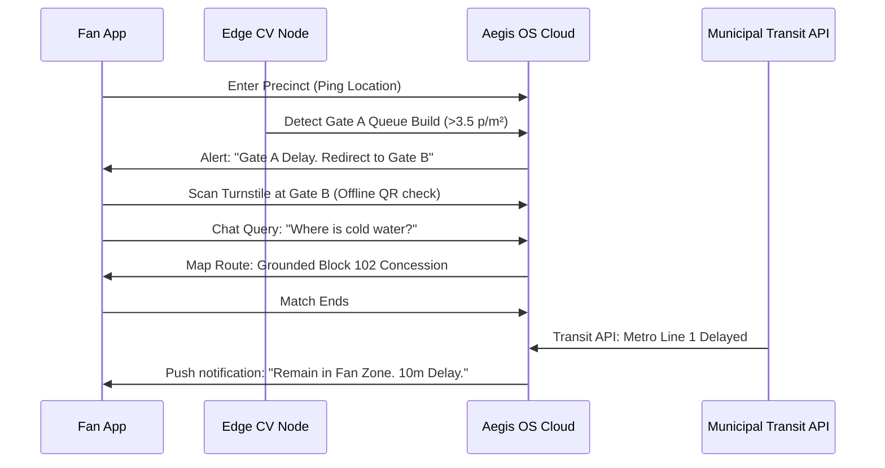

# Aegis Smart Stadium OS: Product Design Document (PDD)

## Document Metadata
* **Version:** 1.0
* **Approval Status:** DRAFT FOR BOARD REVIEW
* **Document Owners:** Principal UX Designer, Design System Architect, Accessibility Specialist
* **Last Updated:** 2026-07-08
* **Dependencies:** [00_PROJECT_BRAIN.md](file:///c:/Users/Asus/OneDrive/Desktop/hackthon%20challnge%204/00_PROJECT_BRAIN.md) (Approved Constitution), [01_PRODUCT_REQUIREMENTS_DOCUMENT.md](file:///c:/Users/Asus/OneDrive/Desktop/hackthon%20challnge%204/01_PRODUCT_REQUIREMENTS_DOCUMENT.md) (Approved PRD)

---

## 1. Executive Summary

Aegis Smart Stadium OS is the flagship operational intelligence platform designed for the FIFA World Cup 2026. Managing 104 matches across three nations (United States, Canada, and Mexico) requires synchronizing physical venue parameters, local municipal transportation, dynamic steward allocation, and multi-lingual fan needs. Aegis OS delivers this orchestration via a **Hybrid AI Platform** that decouples sub-20ms edge computer vision from high-latency multi-agent reasoning.

This Product Design Document (PDD) establishes the definitive UX/UI architecture, design patterns, and interactive specifications for all Aegis OS interfaces. Every layout, element, notification style, and conversational pattern documented herein is built to reduce cognitive load, enforce accessibility compliance, and build operational trust.

---

## 2. Design Vision

The design vision of Aegis OS is built around **"The Aesthetics of Safety and Flow."**
Operational dashboards and consumer interfaces should not feel like utility tools; they must operate with premium clarity, feeling responsive, calm, and predictive.

```
                    +---------------------------------------+
                    |        PREDICTIVE VISUALIZATION       |
                    |   Anticipate bottlenecks & hazards    |
                    +---------------------------------------+
                                        │
                                        ▼
  +-------------------------------------+-------------------------------------+
  |             CALM OPERATIONS         |          FRICTIONLESS MOBILITY      |
  | Low cognitive load under pressure.  | Dynamic paths and seamless transfers|
  +-------------------------------------+-------------------------------------+
```

* **Calm Operations:** Command center personnel must make split-second safety decisions. Visual density is managed via hierarchical information nesting, adaptive dark modes, and color palettes that draw the eye only to critical events.
* **Frictionless Mobility:** On-ground volunteers, stewards, and fans experience a continuous flow where information updates dynamically based on physical coordinates.
* **Universal Dignity:** Accessibility is baked into the layout structure, ensuring users of all physical abilities experience equal navigational speed.

---

## 3. UX Principles

To keep user workflows focused on efficiency and safety, the Aegis OS interfaces adhere to three core UX principles:

1. **Context over Command:** Prevent information overload by presenting only the telemetry, logs, and buttons relevant to the user’s current coordinates, role, and time window.
2. **Graceful Redirection:** Never present a blocker (e.g., "Elevator offline" or "Gate crowded") without instantly offering a validated path alternative.
3. **Decoupled Verification:** Generative AI generates recommendations and automates drafts, but critical actions are locked behind explicit physical confirmation steps.

---

## 4. Design Principles

Aegis OS interface design translates raw telemetry into a unified spatial experience using the following guidelines:

* **High-Contrast Dark Mode by Default:** All command center displays, operations consoles, and staff mobile devices utilize high-contrast dark themes to minimize eye strain and preserve battery life during long matchday shifts.
* **8px Spatial Grid:** Consistent geometric spacing (8px, 16px, 24px, 32px, 48px, 64px) enforces alignment across all screen resolutions and devices.
* **Visual Anchoring:** Colors are used exclusively as functional markers. Crimson signifies emergency, Amber warns of impending bottlenecks, Emerald confirms resolution, and Cyber Blue denotes AI recommendations.
* **Micro-Response Loops:** Every tap, swipe, and voice trigger must initiate an immediate micro-animation or haptic response within 100ms, establishing interface certainty.

---

## 5. Information Architecture

Aegis OS organizes venue operations, public safety, and customer experience into a unified, non-redundant data tree:

```
[Aegis OS Root]
├── [Global Command Console] (Desktop / Large Displays)
│   ├── Unified Digital Twin Map
│   │   ├── Perimeter Ingress Telemetry (Density/Queue lengths)
│   │   ├── Seating Bowl Occupancy Heatmaps (BMS Sync)
│   │   └── Concourse Walkways (Flow Rate Vectors)
│   ├── Operational Modules
│   │   ├── Incident Triage Hub (CCTV & Acoustic Feeds)
│   │   ├── Transit Sync Controller (Egress Gates & Metro Schedules)
│   │   └── Resource Manager (Steward & Volunteer Coordinates)
│   └── System Administration & Audit Logs
│
├── [Staff App Portal] (Mobile / Tablet)
│   ├── Task Allocation Queue (Contract Net Protocol updates)
│   ├── Navigation & Incident Mapping (Turn-by-turn interior wayfinding)
│   ├── Broadcast Alert Center
│   └── Translation & Profile Settings
│
└── [Fan Concierge App] (Mobile)
    ├── GenAI Conversational Interface (Wayfinding, POS, Ticketing support)
    ├── Grounded Offline Seat Navigation (ADA & standard routes)
    ├── Smart Ticketing Credentials (Offline QR)
    └── Transit Sync Planner
```

---

## 6. Navigation Architecture

Aegis OS navigation models prioritize fast recovery and clear exits.

* **Command Console (Desktop/Large Screen):** Left-docked, collapsible Navigation Rail providing primary workspace switches. Top bar provides quick-status KPI badges and global voice prompt bar.
* **Staff Mobile App:** Bottom Navigation Bar containing four fixed tabs: `Tasks`, `Precinct Map`, `Inbox`, and `Profile`. Critical system alerts trigger an immediate modal overlay.
* **Fan Mobile App:** Conversational Hub UI. The bottom drawer hosts the persistent GenAI Chat prompt, while sliding tabs above it provide direct access to `Digital Ticket`, `Seat Route`, and `Transit Sync`.

---

## 7. Complete User Journey Maps

### A. The Spectator / Fan Journey



* **Touchpoints:** Outer perimeter queue, turnstile entry, concourse wayfinding, concession purchase, seat lookup, egress transit sync.
* **Friction Points:** Congested entry checkpoints, loss of internet connectivity inside the concourse, delayed city rail lines.
* **Remediation:** Live routing redirections, offline ticket verification, concourse lounge activation incentives during transit pauses.

### B. The Volunteer Wayfinder Journey

```mermaid
sequenceDiagram
    participant Vol as Volunteer App
    participant Agent as Volunteer Agent
    participant SOC as Command Console

    Vol->>Agent: Check-in (07:00 at Gate D)
    Agent->>Vol: Fetch Shift Briefing & SOP Layout
    Note over Agent, Vol: Ingress bottleneck detected at Gate F
    Agent->>Vol: Task Proposal: "Redeploy to Gate F, Sec 3"
    Vol->>Agent: Accept proposal (Tap)
    Agent->>Vol: Inside Navigation Route (ADA Compliant)
    Vol->>SOC: Voice input: "Lost Child Found: Green shirt"
    SOC->>Agent: Log verified; parent notification triggered
```

* **Touchpoints:** Gate check-in, task queue, dynamic redeployment routing, multi-lingual spectator translation assistance, lost child logging.
* **Friction Points:** GPS drift inside concrete corridors, radio channel chatter, language barriers with international tourists.
* **Remediation:** Offline visual navigation markers, automated speech-to-text translation interface, template-based incident escalations.

### C. The Security Steward Journey
* **Phase 1: Shift Briefing:** Log in at 07:00, authenticate via MFA, verify smart-band connection, review assigned precinct zone.
* **Phase 2: Patrol Mode:** Receive live perimeter flow data. System monitors steward coordinates.
* **Phase 3: Active Response:** Smart-band vibrates. Aegis OS issues dispatch: "Physical dispute in Block 204, Row 12."
* **Phase 4: Resolution:** Steward follows target navigation, de-escalates, logs resolution note, updates command.

### D. The Operations Commander Journey
* **Phase 1: Ingress Sweep:** Monitors the digital twin display. Reviews edge computer vision queue metrics across all 16 entry gates.
* **Phase 2: Surge Balancer:** Authorizes the redirection recommendations generated by the system to balance crowds.
* **Phase 3: Crisis Orchestration:** Evacuation alarm triggers. Commander reviews the system's proposed plan and initiates PAVA commands.
* **Phase 4: Reporting:** After lockdown, reviews the reporting agent's carbon footprint and incident resolution logs.

### E. The Medical Team Journey
* **Phase 1: Readiness:** Medics stand by in localized treatment areas, profiles active, tracking enabled.
* **Phase 2: Alert Ingestion:** Aegis OS detects a collapsed spectator on CCTV, creates an incident file, and highlights coordinates.
* **Phase 3: Emergency Dispatch:** Medics receive a route map that overrides locks on elevators and security gates.
* **Phase 4: On-Site Triage:** Medics stabilize the patient, update progress via app, and log transport details.

### F. The Accessibility User Journey
* **Phase 1: Dynamic Ingress:** Wheelchair user arrives. App displays an alternate ADA-compliant path, avoiding stairs.
* **Phase 2: In-Match Support:** User asks for an accessible restroom. App routes them around high-density concourses.
* **Phase 3: Outage Recalculation:** Elevator 4 breaks down. Aegis OS detects the failure and recalculates their path via Elevator 5.
* **Phase 4: Safe Egress:** User is guided along a dedicated wheelchair exit lane synced with accessible city transit vehicles.

### G. The Transport Authority Journey
* **Phase 1: Egress Planning:** Operator inputs train schedules into Aegis OS, syncs target platform capacities.
* **Phase 2: Inflow Control:** Trains arrive at stadium station. System streams occupancy levels.
* **Phase 3: Turnstile Syncing:** Aegis OS adjusts stadium exit turnstile rates to prevent platform overcrowding.
* **Phase 4: Emergency Halt:** Metro Line 1 stalls. Transit agent halts exit turnstiles, redirecting fans to designated wait zones.

### H. The Administrator Journey
* **Phase 1: Configuration:** Admin sets CCTV threshold parameters and updates multi-lingual dictionary resources.
* **Phase 2: Health Checks:** Verifies edge nodes, camera calibration, and system latencies.
* **Phase 3: User Access:** Manages roles, profiles, and credentials.
* **Phase 4: Deployment:** Deploys system firmware and vector database index updates.

---

## 8. Screen Inventory

| Screen Name | Purpose | Primary User | Entry Points | Exit Points |
| :--- | :--- | :--- | :--- | :--- |
| **Splash** | System boot, offline sync status verification | All Users | App launch | Login / Home |
| **Login** | Secure authentication (MFA / Biometric verification) | All Users | Splash / Timeout | Language / Home |
| **Language Selection** | Quick locale configuration | All Users | Login / Settings | Home |
| **Home Portal** | Master hub providing role-based dashboard access | All Users | Login | Any primary module |
| **Operations Dashboard** | 3D Digital Twin environment & telemetry controls | Ops Commander | Home / Nav Rail | Incident / Settings |
| **Crowd Map** | Heatmap visualization of queues and flow vectors | Ops / Security | Dashboard | Incident Center |
| **Incident Triage Center** | Dispatch center for alarms, logs, and routing | Ops / Security / Medics | Dashboard / Alert | Home |
| **Volunteer Tasks** | Contract Net task lists and assignments | Volunteers | Home / Notification | Profile / Map |
| **Fan Concierge Chat** | GenAI Conversational interface | Fans | Home / Drawer | Wayfinding Map |
| **Navigation & Mapping** | Dynamic interior and ADA wayfinding | Fans / Staff | Fan Chat / Dispatch | Home |
| **Emergency Broadcast Overlay** | Evacuation maps and safety instructions | All Users | System Override | Auto-dismiss |
| **System Settings** | Device configurations & offline settings | All Users | Navigation / Profile | Home |
| **Reports Archive** | Markdown and compliance log reviews | Ops / Admin | Home | Print / Export |
| **Analytics Suite** | Historical trend charts and predictions | Executive / Ops | Home | Dashboard |
| **Admin Panel** | Infrastructure health checks & RBAC configuration | Administrator | Home | Settings |
| **Profile** | User details and language configuration | All Users | Navigation | Home |
| **Notification Center** | Categorized list of updates and alerts | All Users | Top Bar / Swipe | Home |
| **Help & Support** | Rules, SOPs, and manual search | All Users | Settings / Chat | Home |
| **Accessibility Panel** | Contrast, text scale, and screen reader options | All Users | Splash / Settings | Home |

---

## 9. Screen Specifications

For brevity and complete functional clarity, screen specifications are organized into the three primary client architectures: **Global Command Console (Desktop)**, **Staff App (Mobile/Tablet)**, and **Fan Concierge App (Mobile)**.

### A. Operations Dashboard (Global Command Console)
* **Purpose:** Provides a centralized, 3D Digital Twin visualization of stadium operations, merging ingress, egress, security alerts, and BMS statuses.
* **Layout:** Grid-based multi-pane layout. Left collapsible Navigation Rail (64px width). Center pane: Interactive WebGL 3D Digital Twin (occupying 70% width). Right pane: Real-time Incident Triage feed (30% width). Top bar: High-level KPI badges (Wait Time, Crowd Density, Active Alerts, Carbon Footprint).
* **Displayed Data:** 3D model of stadium precinct with live coordinate markers; turnstile validation velocity charts; heatmaps color-coded by density (safe, watch, warning); active incident list sorted by priority (Critical, Medium, Low).
* **Primary Actions:** Deploy Steward recommendation, Adjust Turnstile Egress Rate, Trigger Evacuation Protocol.
* **Secondary Actions:** View CCTV stream, Acknowledge alert, Filter by gate, Open historic report.
* **States & Edge Conditions:**
  * *Loading:* Skeleton grids with animated pulsing gradients; digital twin loads in low-res draft and sharpens.
  * *Offline:* Displays top bar banner "OPERATING IN LOCAL MESH MODE - RESTRICTED EXTERNAL TELEMETRY". Maps fall back to cached local vector databases.
  * *Error:* Displays alert modal "CCTV Node offline - Sector South. Fallback to adjacent feeds initiated."
* **Accessibility:** High-contrast focus states (3px dashed Cyber Blue borders). Screen readers announce: "Operations Dashboard: 3 active critical incidents at South Gate." Heatmaps utilize deuteranopia-safe styling patterns (shades of blue and orange instead of green and red).
* **Responsive Behavior:** On tablet displays, the right triage pane collapses into a swipe-out tray, and the left navigation rail collapses into a hamburger icon.

### B. Fan Concierge Chat (Fan Mobile App)
* **Purpose:** Deliver natural-language navigational and logistical support to spectators attending matches.
* **Layout:** Bottom drawer interface (Apple HIG compliant). The upper part shows the maps/ticket container, and the lower drawer contains the conversational feed with a text input field and microphone button.
* **Displayed Data:** Chat bubbles with rounded corners (left: gray, right: Cyber Blue). The AI answers show confidence icons (e.g., green shield for high confidence) and citations (e.g., "[SOP Section 4]"). Maps show accessible paths.
* **Primary Actions:** Send query, Turn on voice nav.
* **Secondary Actions:** Expand ticket QR code, Pre-order concessions, View transit options.
* **States & Edge Conditions:**
  * *Loading:* Typing indicator animation (three pulsing dots).
  * *Offline:* Text input remains enabled but displays: "Offline Mode. GenAI paused. Accessing offline seating maps and ticket."
  * *Error:* "Failed to generate recommendation. Redirecting to nearest Volunteer steward."
* **Accessibility:** Voice assistant features for screen reader users. Large touch targets (minimum 48x48px). High-contrast text matches WCAG 2.2 AA (minimum 4.5:1 ratio).

### C. Volunteer Tasks (Staff Mobile App)
* **Purpose:** Provide on-ground volunteers and stewards with dynamic shift assignments and incident dispatch routing.
* **Layout:** Card-based list interface. Split tabs at the top: `Active Task` and `Task History`. The map button floats at the bottom-right for quick coordinate access.
* **Displayed Data:** Task cards showing title, target coordinates, priority, skills required, elapsed time, and a dynamic map snippet.
* **Primary Actions:** Accept Shift Allocation, Resolve Incident, Trigger Escalation.
* **Secondary Actions:** Open translation tool, Call SOC.
* **States & Edge Conditions:**
  * *Loading:* Pulsing card placeholder shapes.
  * *Offline:* Displays: "Offline Mode - Task list saved locally. Re-syncing when connection is restored."
  * *Error:* "Failed to sync task. Refreshing GPS..."
* **Accessibility:** Smart haptic patterns for task arrivals. Focus indicator circles around primary buttons. Large fonts for easy readability in sunlight.

---

## 10. Design System

Aegis OS utilizes a dark-mode-first design system that prioritizes clarity, fast interaction, and accessibility compliance.

### A. Color Palette

```
+-------------------------------------------------------------+
|  Primary Navy (#0A1128)      │  Dark background/Containers  |
|  Cyber Blue (#00E8FC)        │  AI indicators & Highlights  |
|  Safety Amber (#FF9F1C)      │  Bottleneck warnings         |
|  Alert Crimson (#E63946)     │  Critical emergency alerts   |
|  Muted Slate (#64748B)       │  Secondary labels & Icons    |
|  Emerald Success (#2EC4B6)   │  Resolved statuses           |
+-------------------------------------------------------------+
```

### B. Typography
* **Font Family:** `Outfit` (Primary UI), `Inter` (Data tables and labels).
* **Headings:**
  * `H1 (Display):` 36px, Bold, Tracking -1.5px (Operations numbers)
  * `H2 (Section):` 24px, Semi-Bold, Tracking -0.5px (Dashboard headings)
  * `H3 (Card):` 18px, Medium (Widget titles)
* **Body Text:**
  * `Body Regular:` 16px, Regular, Line-height 1.5
  * `Body Small:` 14px, Regular (Labels and microdata)
  * `Caption:` 12px, Light (Timestamps and citations)

### C. Spacing & Grid
* **Baseline Grid:** 8px. Margin boundaries: Mobile (16px), Tablet (24px), Desktop (32px).
* **Layout Spacing:** Elements are separated by 8px, 16px, 24px, or 32px based on relationships.

### D. Component Library

#### Buttons
* **Primary Action:** Solid Cyber Blue background, Dark Navy text. Rounded corner: 8px. Hover: brightness(110%).
* **Secondary Action:** Transparent background, 1.5px Cyber Blue border, Cyber Blue text.
* **Destructive Action:** Solid Alert Crimson background, White text. Used exclusively for emergencies.

#### Cards
* **Layout:** Dark Navy base container (`#121C3E`), 1px Muted Slate border, 8px rounded corners.
* **Elevated State:** Subtle Cyber Blue shadow (`box-shadow: 0 4px 20px rgba(0, 232, 252, 0.15)`).

#### Forms
* **Input Field:** Dark container, 1px border. Changes to solid Cyber Blue on focus.
* **Error State:** Border shifts to Crimson with validation message below.

#### Charts
* **Visual Styling:** Transparent base. Ingress/egress velocity graphs utilize gradient lines (from Primary Navy to Cyber Blue).
* **Contrast:** Grid lines in charts maintain a 3:1 contrast against backgrounds.

#### Tables
* **Layout:** Flat styling. Sticky header row with Muted Slate labels. Zebra striping uses a `#16224F` alternate background.

#### Maps
* **Theme:** Vector maps utilizing custom dark styling. Water and structures are presented in `#0A1128`, pathways in Slate, and active coordinates highlighted with glowing pins.

#### Badges
* **High Priority:** Alert Crimson base with white text.
* **Warning:** Safety Amber base with dark Navy text.
* **Success:** Emerald Success base with white text.

#### Dialogs & Modals
* **Structure:** Centered overlays with semi-transparent backdrops (`backdrop-filter: blur(8px)`).

#### Navigation Elements
* **Desktop Rail:** 64px width, icons stacked vertically. Active workspace icon uses a Cyber Blue color overlay.

#### Icons
* **Library:** Google Material Design Icons (filled variant for active states, outlined for default states).

#### Shadows
* **Soft Depth:** `box-shadow: 0 8px 32px rgba(0, 0, 0, 0.5)` for elevated cards and dropdown menus.

#### Motion
* **Transition Speed:** Standard interface movements execute at `200ms` with ease-out cubic-bezier easing (`cubic-bezier(0.16, 1, 0.3, 1)`).

---

## 11. AI Conversation Design

Conversational interactions with the GenAI Fan Concierge are designed to build trust and prevent operational errors.

### Prompt UX
* **Input Guidance:** The input field displays placeholder cues like: *"Ask me about ADA gates, concession wait times, or train connections..."*
* **Auto-completion:** Dynamic query chips (e.g., *"How do I get to Block 102?"*, *"Concessions nearby"*) float above the input bar to speed up entry.

### Voice UX
* **Visual indicator:** When listening, the microphone icon morphs into a glowing, wave-like frequency animation.
* **System Voice:** Synthesized audio is spoken at a natural rate (150 words per minute) with pauses between paragraphs.

### Clarification & Fallback UX
* **Clarification:** If a query is ambiguous (e.g., *"Where is my seat?"*), the system does not guess. It prompts: *"I see you have two tickets. Are you looking for your seat in Block 102 or Block 204?"*
* **Fallback:** If the model's confidence rating drops below `85%`, the system outputs: *"I am not certain about that route. I have marked your coordinates and requested an on-ground volunteer steward to assist you."*

### Trust & Confidence Indicators
* **Confidence Badge:** Recommendations display a subtle confidence rating indicator (e.g., green shield for high confidence, orange warning icon for medium confidence).
* **Source Citations:** Conversational route directions and safety messages include parenthetical references (e.g., `[Stadium SOP p.14]`), allowing operators to verify the output source.

### Human Override & Conversation Memory
* **Human Override:** Users can tap a persistent "Call Steward" button to transfer the chat session and coordinates to a human volunteer.
* **Conversation Memory:** The assistant retains context for up to 10 dialogue turns within a 1-hour window before clearing cache to protect privacy.

---

## 12. Accessibility Design

Aegis OS complies fully with WCAG 2.2 AA standards, ensuring complete accessibility across all features.

```
                  +-----------------------------------------+
                  |         WCAG 2.2 AA COMPLIANCE          |
                  |  All components meet AA accessibility   |
                  +-----------------------------------------+
                                       │
                                       ▼
  +------------------------------------+------------------------------------+
  |             AUDIO / VISION         |               NAVIGATION           |
  | High contrast, screen readers,     | Keyboard navigation, focus states, |
  | speech-to-text inputs.             | ADA-compliant routing options.     |
  +------------------------------------+------------------------------------+
```

* **Keyboard Navigation:** Web workspaces support tab navigation. Focus indicators are highlighted with a 3px Cyber Blue border.
* **Screen Reader Support:** All buttons, icons, and dynamic widgets contain explicit ARIA labels (e.g., `<button aria-label="Acknowledge South Gate Alert">`).
* **High Contrast Mode:** Users can toggle a high-contrast theme that increases text contrast to 7:1 against backgrounds.
* **Color Blind Support:** Heatmaps and charts avoid red/green dependencies, utilizing blue/orange palettes instead.
* **Reduced Motion:** Enabling this option disables non-essential animations, page transitions, and digital twin rotations.
* **Captions & Large Text:** System alerts support real-time caption streams. Font scales can be adjusted up to 200% without breaking layouts.
* **Offline Accessibility:** Static ADA maps and emergency exit directions are saved locally, ensuring accessibility features continue to work during connection outages.

---

## 13. Notification Design

Notifications are prioritized by urgency, using custom visual styles, sounds, and haptic patterns.

### Priority Levels

#### Critical (Emergency / Crisis)
* **Visual Style:** Deep crimson border, red warning icon, full-screen modal override.
* **Sound:** Repeated high-frequency tone.
* **Haptic Pattern:** Continuous triple pulse.
* **Escalation:** If not acknowledged within 15 seconds, the notification escalates to a voice broadcast over the PAVA system.

#### Warning (Bottleneck / Incident Risk)
* **Visual Style:** Amber border, caution icon, top-docked sliding banner.
* **Sound:** Double pulse tone.
* **Haptic Pattern:** Double pulse.
* **Escalation:** Escalates to a Critical alert if density metrics continue to climb for 3 minutes.

#### Info (Logistics / Tasks / Inquiries)
* **Visual Style:** Cyber blue border, standard info icon, silent card insertion.
* **Sound:** None.
* **Haptic Pattern:** Short single tap.
* **Escalation:** Clears automatically once read or when coordinates change.

---

## 14. Dashboard Design

Each dashboard variant is optimized to help specific users make decisions quickly.

### A. Operations Dashboard (Ops Commander)
* **Widgets:** Digital Twin Viewport, Queue Wait-Time Panel, Ingress Velocity Tracker, Security Log Feed.
* **Charts:** Bar charts mapping turnstile scans per minute; line graphs showing crowd density.
* **KPIs:** Active Incidents, Total Venue Occupancy, Average Ingress Velocity, Energy Savings %.
* **Filters:** Sector (North, South, East, West), Gate ID, Level (1, 2, 3), Time Frame.
* **Actions:** Trigger Evacuation, Adjust Gate Flow Rates, Broadcast Message to Volunteers.

### B. Security Dashboard (Security / Medical)
* **Widgets:** Acoustic Anomaly Tracker, Live CCTV Node Grid, Steward GPS Coordinates, Dispatch Queue.
* **Charts:** Area charts mapping acoustic levels; pie charts showing incident types.
* **KPIs:** Average Response Time (Target < 3 mins), Active Dispatches, Available Stewards.
* **Filters:** Incident Category (Medical, Crowd, Facilities), Priority Level, Precinct Zone.
* **Actions:** Dispatch Steward, Verify Incident, Request Police Coordination.

### C. Volunteer Dashboard (Volunteers / Wayfinders)
* **Widgets:** Task Allocation Feed, Precinct Navigation View, Multi-lingual Translation Hub.
* **Charts:** Daily task completion bar charts.
* **KPIs:** Assigned Gate, Task Completion Rate, Shift Time Remaining.
* **Filters:** Assigned Zone, Language, Task Priority.
* **Actions:** Accept Task, Mark Completed, Escalated to SOC.

### D. Transport Dashboard (Transit Authority)
* **Widgets:** Transit Line Capacity Grid, Station Platform Occupancy Monitor, Rideshare Queue Level.
* **Charts:** Flow rate curves comparing stadium egress velocity with incoming train capacities.
* **KPIs:** Train Arrival ETA, Station Platform Density, Rideshare Wait Time.
* **Filters:** Transit Mode (Metro, Bus, Rideshare), Station ID.
* **Actions:** Sync Egress Pacing, Dispatch Shuttle Fleet, Adjust Signal Timing.

### E. Executive Dashboard (FIFA / LOC Managers)
* **Widgets:** Multi-venue Ingress Overview, Carbon Footprint Tracker, Concession Sales Performance.
* **Charts:** Comparison graphs of crowd flows across all 16 stadiums.
* **KPIs:** Overall Safety Rating, Commercial Revenue, Carbon Footprint Reduction %, Volunteer Turnout.
* **Filters:** Stadium City, Match Day, Metric Category.
* **Actions:** Export Compliance PDF, Open Venue Audit Log.

### F. Fan Dashboard (Spectators / Fans)
* **Widgets:** GenAI Wayfinding Map, Mobile Concession Pre-order, Transit Sync Planner.
* **Charts:** Custom queue time bar charts for nearby restrooms and concession stands.
* **KPIs:** Gate Wait Time, Seat Distance (m), Next Metro Departure.
* **Filters:** Dietary, Restroom Type, Transport Type.
* **Actions:** Generate Route, Order Food, Scan Digital Ticket.

---

## 15. Mobile Experience
* **Platform Constraints:** Screen sizes range from 5.5" to 6.7". The design focuses on bottom-sheet interactions, large tap targets (minimum 48x48px), and offline caching support.
* **Gestures:** Horizontal swipes switch navigation tabs. Swipe up opens the GenAI Fan Chat drawer.

## 16. Tablet Experience
* **Platform Constraints:** Screen sizes range from 10" to 12.9". Utilizes split-pane views where lists are docked on the left and detail maps are shown on the right, eliminating the need to drill down into menus.
* **Interaction:** Stylus input support for quick notations on incident logs.

## 17. Desktop Experience
* **Platform Constraints:** Responsive layouts adapting from 1920x1080 to 2560x1440. Optimized for multi-monitor setups.
* **Window Management:** Supports custom grid layouts where operators can dock and undock widgets like CCTV grids.

## 18. Large Command Center Display Experience
* **Platform Constraints:** Large display walls (e.g., 4K/8K displays) in the Miami TOC. Designs use large typography and high-contrast styling to ensure text is readable from 15 meters away.
* **Automation:** Telemetry layouts rotate automatically, highlighting active warning sectors without requiring manual interaction.

---

## 19. Microinteractions
* **Turnstile Status Pulse:** When a gate scan succeeds, the turnstile indicator on the digital twin pulses with a green glow, confirming the scan.
* **Voice Active Wave:** The conversational microphone button expands into an active sound wave animation when recording.
* **Alert Shake:** Warning cards perform a subtle horizontal shake animation when first added to the feed, drawing attention.
* **Task Complete Swipe:** Swiping a task card to the right reveals an emerald completion checkmark, confirming the action.

---

## 20. Motion Guidelines
* **Navigation transitions:** Sliding panels slide in from the screen edges using ease-out easing over `250ms`.
* **State changes:** Interactive buttons scale down slightly (`scale(0.98)`) when pressed, providing instant feedback.
* **Alert overlays:** Critical emergency overlays scale up from the center over `150ms`, accompanied by a blur effect.

---

## 21. UX Metrics
* **System Usability Scale (SUS):** Target score > 85 across all stakeholder user categories.
* **Task Completion Rate (TCR):** Target > 98% for emergency dispatches and redirect tasks.
* **Task Completion Time (TCT):** Average steward dispatch processing time under 15 seconds.
* **Search Success Rate:** GenAI search success rate > 92% on first query.
* **Aesthetic Impression Rating:** Aesthetic satisfaction rating > 90% in post-event reviews.

---

## 22. Design Validation Checklist

### General UX/UI
* [ ] Verify all interactive elements have a tap target of at least 48x48px.
* [ ] Confirm the default contrast ratio matches WCAG 2.2 AA (4.5:1 minimum).
* [ ] Validate that all modals can be closed using the Escape key or a clear close button.

### Mobile & Tablet
* [ ] Test that the bottom navigation bar is reachable with one thumb on mobile devices.
* [ ] Verify that maps and tickets remain accessible when cellular connections are lost.
* [ ] Ensure all input screens support screen rotation without breaking the layout.

### Accessibility (WCAG 2.2 AA)
* [ ] Confirm all images, buttons, and maps have descriptive ARIA labels.
* [ ] Verify the high-contrast theme maintains a 7:1 contrast ratio.
* [ ] Test tab navigation flow to ensure keyboard focus indicators are clearly visible.

### Command Center Displays
* [ ] Confirm telemetry screens are readable from a distance of 15 meters.
* [ ] Validate that the digital twin maps support fluid zoom and rotate gestures.
* [ ] Ensure warnings and alerts are highlighted with color blind-safe alternatives.

---

## Continue PDD
