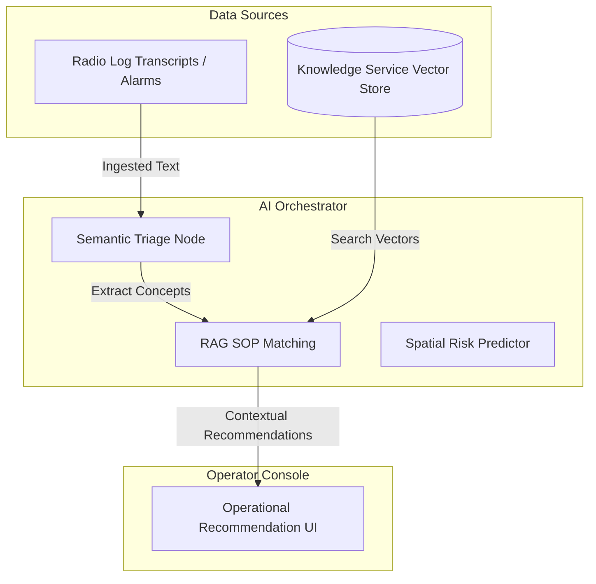

# Aegis Smart Stadium OS: Phase 10 - AI Orchestration & Multi-Agent Design

This document describes the AI architecture of Aegis OS, detailing the semantic retrieval systems (RAG), the predictive modeling engines, and the FIPA-ACL agent coordination mechanics.

---

## 1. Multi-Agent Coordination Protocol (FIPA-ACL)

To prevent execution conflicts and message loops between specialized agents (Crowd, Incident, Volunteer, Transit, Accessibility, Knowledge), agents communicate via JSON-encoded **FIPA Agent Communication Language (FIPA-ACL)** envelopes:

```json
{
  "performative": "CFP",
  "sender": "agent://planner",
  "receiver": "agent://volunteer",
  "reply-with": "vol-bid-992",
  "content": {
    "task": "allocate_stewards",
    "location": { "lat": 25.778, "lng": -80.191, "zone": "Gate C" },
    "required_skills": ["medical", "first_aid"],
    "headcount": 2
  }
}
```

### Protocol Steps:
1. **Request for Proposal (CFP)**: The `Planner Agent` broadcasts a request to task-specific agents.
2. **Propose / Refuse**: Domain agents respond with proposed actions (bids) or refuse due to constraints.
3. **Accept / Reject**: The `Planner Agent` evaluates proposals and sends an acceptance or rejection envelope.
4. **Execution Log**: Once execution completes, the winning agent sends an `INFORM` update to the `Reporting Agent`.

---

## 2. Core AI Workflows



### 2.1 Knowledge Retrieval & SOP Integration (RAG)
- **Goal**: Supply operators with exact guidelines when responding to anomalies.
- **Workflow**:
  1. Incident service reports a "Suspicious Package Found in Concourse 2".
  2. The `Knowledge Agent` generates a vector embedding of the incident text.
  3. Executes a similarity search against the Vector DB containing venue-specific Standard Operating Procedures (SOPs).
  4. Returns the top 3 relevant security steps (e.g., "Establish 100m cordon", "Do not use radios within 10m").
  5. The LLM summarizes this context into a bulleted "Suggested Actions" card on the operator dashboard.

### 2.2 Crowd Risk Prediction
- **Goal**: Forecast crowd density bottlenecks 60 minutes before they occur.
- **Workflow**:
  1. Monitors current gate arrival rates and matches historical arrival distributions.
  2. Spatial-Temporal Neural Networks project flow velocities and estimate accumulation.
  3. If predicted density crosses `4.5 people/m²`, the system flags a "High Risk" event.
  4. Proposes proactive gate gating speeds and volunteer wayfinding reallocations.

### 2.3 Volunteer Dynamic Allocation Recommendations
- **Goal**: Identify and deploy the best suited volunteers during bottlenecks.
- **Workflow**:
  1. Crowd Agent reports ticket queue delays at Gate F.
  2. Volunteer Agent queries active steward database for matching criteria (proximity, language skills, first-aid certification).
  3. Runs a Hungarian Algorithm to solve the optimal assignment cost matrix.
  4. Proposes optimal steward movements to the operator.

### 2.4 Transit Egress Synchronization Pacing
- **Goal**: Calculate real-time egress throughput to prevent transit platform overcrowding.
- **Workflow**:
  1. Reads incoming train coordinates and calculates capacity limits (e.g., Train arrives in 6 mins, holds 1,200 passengers).
  2. Measures exit corridor flow velocities.
  3. Computes optimal turnstile rotation delays (e.g., restrict Gate D to 100 entries/min).
  4. Displays a "Transit Pacing Recommendation" to the Operator with a single-click apply command.

### 2.5 Natural Language Query Processor
- **Goal**: Support conversational ad-hoc reporting for Command Directors.
- **Workflow**:
  1. Operator queries: *"How many volunteer medics are available near Sector B?"*
  2. Semantic Parser converts text into structured SQL queries or GraphQL queries.
  3. Executes query against read replicas.
  4. Formulates a natural language summary with clickable resource links.
