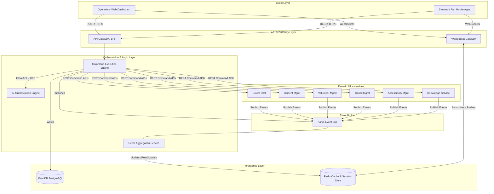

# Aegis Smart Stadium OS: Phase 10 - Operations Command Center Architecture

This document defines the central orchestration architecture of the Operations Command Center (OCC), which acts as the brain of the Aegis Smart Stadium OS.

---

## 1. Overall System Architecture

The Operations Command Center is structured into distinct, decoupled architectural layers. It is designed to handle high-velocity sensor telemetry and complex operational workflows while guaranteeing high availability and human-in-the-loop validation.

---

## 2. Core Modules and Responsibilities

### 2.1 Event Processing & Aggregation Layer
- **Responsibility**: Ingests real-time events from all domain services via Kafka, performs temporal window aggregation, and writes highly optimized, denormalized read models to Redis for instant dashboard access.
- **Key Component**: `EventAggregationService` – Listens to topics like `crowd.density.v1`, `incidents.status.v1`, `transit.shuttles.v1`. It processes telemetry over sliding windows (e.g., 1-minute, 5-minute averages) and generates aggregated views.

### 2.2 Command Execution Layer
- **Responsibility**: Processes all incoming operations (commands) sent by the dashboard or automated triggers. Enforces strict RBAC permissions, manages transaction boundaries, updates the persistent PostgreSQL database, and publishes command success/failure events to Kafka.
- **Key Component**: `CommandBus` & `CommandHandlerFactory` – Implements the Command Pattern. Matches incoming Command payloads (e.g., `AssignStewardCommand`) with their appropriate service handlers.

### 2.3 Dashboard Backend (BFF - Backend For Frontend)
- **Responsibility**: Services the front-end clients (Web Dashboard and Mobile apps) by serving REST APIs and managing WebSocket connections. It abstracts internal microservice complexity behind a unified GraphQL/REST gateway.
- **Key Component**: `WebSocketGateway` – Manages connection lifecycles, active subscriptions, room mapping, and heartbeats.

### 2.4 AI Orchestration Layer
- **Responsibility**: Interfaces with Large Language Models (LLMs) and Vector Databases (RAG) to provide operational suggestions, summarize radio transcripts, perform similarity matching for incidents, and run predictive risk assessment models.
- **Key Component**: `AIOchestrator` – Coordinates the Multi-Agent Network, ensuring agents communicate via FIPA-ACL JSON schemas without entering infinite recursion.

---

## 3. Operations Command Center Module Matrix

| Module Name | Language/Stack | Main Responsibility | Key Dependency |
| :--- | :--- | :--- | :--- |
| **Command Gateway** | Go / FastAPI | Unified entry point for REST Command APIs, JWT authentication, rate limiting. | Redis (Rate Limiter) |
| **Event Aggregator** | Python (Celery/Kombu) | High-speed ingestion of Kafka telemetry, computes windowed counts & heatmaps. | Kafka, Redis |
| **State Coordinator** | Go | Tracks state machines for complex multi-service workflows (e.g., Evacuation). | PostgreSQL |
| **WebSocket Hub** | Node.js (Socket.io) | Pub-Sub event routing to dashboard clients, manages room memberships. | Redis Pub/Sub |
| **AI Orchestrator** | Python | Orchestrates RAG lookups, agent negotiation, and natural language query translation. | Knowledge Service, LLM API |
| **Audit Logger** | Go | Immutable audit trailing for sensitive operator commands. | PostgreSQL |
