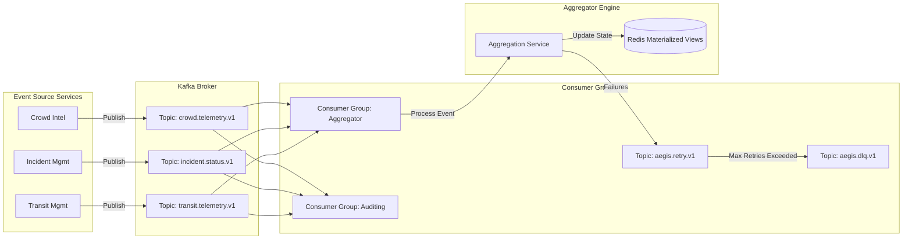

# Aegis Smart Stadium OS: Phase 10 - Kafka Event & Aggregation Architecture

This document details the event-driven system design, focusing on the Kafka event streaming topology, message retry strategies, correlation, and the aggregation service patterns.

---

## 1. Kafka Event Flow Diagram



---

## 2. Topic Registry & Schema Registry

To ensure data contracts, all messages use Protobuf schemas stored in a schema registry.

| Topic Name | Publisher | Main Consumers | Description |
| :--- | :--- | :--- | :--- |
| `crowd.telemetry.v1` | Crowd Intelligence | Aggregator, AI Orchestrator | Edge camera spatial counts and velocity metrics. |
| `incident.status.v1` | Incident Service | Aggregator, Volunteer, Notifications | Lifecycle modifications for safety and medical incidents. |
| `volunteer.tracking.v1` | Volunteer Service | Aggregator, AI Orchestrator | Dynamic GPS coordinates and shift states of stewards. |
| `transit.telemetry.v1` | Transit Service | Aggregator, Crowd, Notifications | Train departure shifts, parking occupancy rates. |
| `accessibility.alerts.v1` | Accessibility Service | Aggregator, Notifications | Outage details for elevators, ramps, or blockages. |

---

## 3. Reliability & Message Delivery Guarantees

### 3.1 Idempotency
- Every event payload includes a unique, deterministic `EventId` (UUIDv4) and a `CorrelationId`.
- Consumers use the **Idempotent Consumer Pattern**: before processing a message, they check Redis with a distributed lock. If `EventId` exists in the set, the message is ignored as a duplicate.

### 3.2 Ordering & Partitioning
- Messages are partitioned using domain keys (e.g., `StadiumZoneId` or `IncidentId`).
- This guarantees sequential message ordering within partitions (e.g., ensuring `IncidentResolved` is processed only after `IncidentCreated`).

### 3.3 Retry & Dead Letter Queue (DLQ) Strategy
1. **First Failure**: Consumer intercepts an exception and writes the message to the retry topic (`aegis.retry.v1`) with a delayed delivery stamp (`30s`).
2. **Backoff Retries**: Up to `3` attempts are executed using exponential backoff (e.g., `30s`, `2m`, `5m`).
3. **DLQ Routing**: If all `3` attempts fail, the message is routed to `aegis.dlq.v1`, triggering an operations alert on the health monitor dashboard.

---

## 4. Aggregation Layer & Materialized Views

To sustain sub-100ms dashboard queries, database scans are replaced by materialized read models in Redis:

```
[Kafka Event Stream] 
       │
       ▼
[Event Aggregator] 
       │
       ├─► [Window Aggregator (1-Min Sliding Window)] ──► Write to Redis: crowd:heatmap:zone_c
       ├─► [State Compiler (Incident Reducer)]        ──► Write to Redis: incident:active:list
       └─► [System Heartbeat Aggregator]              ──► Write to Redis: infrastructure:health
```

- **Materialized Views**: Redis hashes store the absolute real-time state of each stadium zone (e.g., capacity, stewards present, transit delays).
- **Snapshot Generation**: Every 10 minutes, a cron worker takes a snapshot of Redis read models and archives them to PostgreSQL for long-term audit reporting and ML model retraining.
