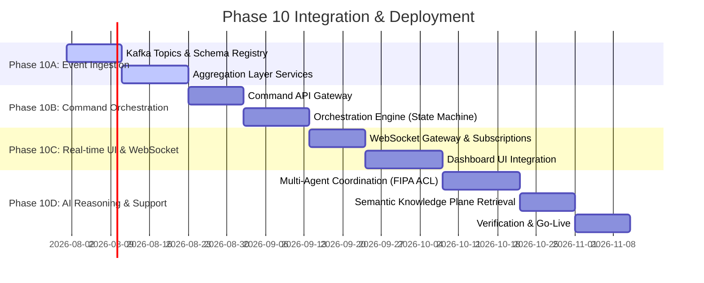

# Aegis Smart Stadium OS: Phase 10 Implementation Plan
## Operations Integration & Command Center Execution Roadmap

This document outlines the phased roll-out plan for implementing Phase 10: the Operations Command Center. It integrates all existing services (Knowledge, Crowd, Incident, Volunteer, Transit, Accessibility, AI, and Core Platform services) into a single operational hub.

---

## 1. Milestones and Sub-Phases

### Phase 10A: Event Ingestion & Aggregation Layer
- **Goal**: Enable streaming telemetry ingestion from all existing services into the central command broker.
- **Key Tasks**:
  1. Define and deploy standardized Protobuf schemas for Kafka topics.
  2. Implement Aggregation Services to build read models.
  3. Set up Redis read caches and materialized view engines.
  4. Implement Kafka correlation tracking.

### Phase 10B: Command Orchestration & API Gateways
- **Goal**: Implement secure command operations with Human-in-the-Loop validations.
- **Key Tasks**:
  1. Establish Command APIs for volunteer assignment, transit dispatch, incident escalation, and route blocking.
  2. Build the multi-step authorization middleware for sensitive commands.
  3. Integrate audit logging for all operator actions.
  4. Design state transition logic for incident response workflows.

### Phase 10C: Real-Time UI & WebSocket Ingestion
- **Goal**: Establish the push-based live dashboard experience.
- **Key Tasks**:
  1. Build WebSocket hubs with dynamic subscription topics.
  2. Implement heartbeat monitoring, reconnection strategies, and client-side caching.
  3. Integrate live widgets (Heatmaps, Timelines, Active Incidents, Health Monitors).

### Phase 10D: AI Reasoning & Multi-Agent Coordination
- **Goal**: Deploy the decision-support engine.
- **Key Tasks**:
  1. Establish multi-agent coordination pipelines utilizing FIPA-ACL JSON envelopes.
  2. Ground LLM prompt templates in the Knowledge Service vector database (RAG).
  3. Deliver predictive risk profiling engines for crowds and transit lines.

---

## 2. Dependencies and Integration Mapping

| Pre-requisite Module | Downstream Impact | Integration Method |
| :--- | :--- | :--- |
| **Authentication & RBAC** | All Command APIs & UI access | Middleware JWT validation with granular permissions |
| **Crowd Intelligence** | Incident generation, transit gating | Kafka streams to Crowd Density topics |
| **Incident Management** | Dispatch workflows, steward assignment | REST APIs for state management, Kafka for updates |
| **Volunteer Management** | Dynamic assignment, steward status | REST commands & FIPA-ACL negotiation |
| **Transit Management** | Egress flow pacing, public transport telemetry | Transit API integrations with WebSocket streaming |
| **Accessibility Management** | Dynamic routing updates | ADA Route blocker events & notifications |

---

## 3. Verification & Acceptance Criteria

### Unit and Integration Tests
- 100% of Event Schemas verified by automated tests.
- Connection resilience tests: WebSocket gateways must recover within `< 500ms` of server-side restarts.
- Load Tests: Dashboards must support `50,000+` updates/sec under `200ms` UI render latency.

### Operational Checks
- Multi-step authorization validation: Any command flagged as `Critical` must block execution until a secondary operator approves.
- FIPA-ACL validation: Ensure agent messaging loops terminate within a max of `5` round-trips.
