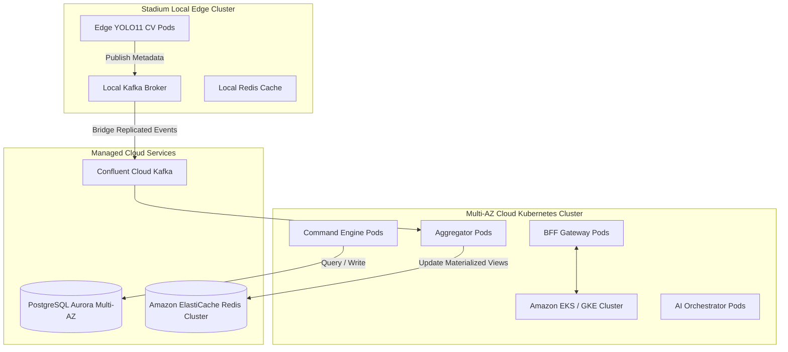

# Aegis Smart Stadium OS: Phase 10 - Production Deployment & HA Roadmap

This document outlines the target deployment architecture for the command center and the high-availability and disaster recovery roadmap.

---

## 1. Production Architecture (Kubernetes & Topology)

Aegis OS is deployed across a hybrid multi-region cluster to balance local low-latency processing and cloud coordination.

### 1.1 Kubernetes Pod Configuration
- **Horizontal Pod Autoscaling (HPA)**: Pods scale dynamically based on CPU/Memory targets (target: 70% utilization) and custom Prometheus metrics (e.g., Kafka lag or active WebSocket connection count).
- **Resource Constraints**: Strict limits are configured for all pods to prevent noisy neighbor scenarios.
  - Command Gateway: `limit: CPU 2, Mem 4Gi`; `request: CPU 500m, Mem 1Gi`.
  - Event Aggregator: `limit: CPU 4, Mem 8Gi`; `request: CPU 1, Mem 2Gi`.

---

## 2. High Availability (HA) & Disaster Recovery (DR)

### 2.1 Database Replication & Failover
- **PostgreSQL Aurora Multi-AZ**: Primary write instance in region A, with synchronous read replicas in region B.
- **Failover Target**: Automated PgBouncer redirection routes transactions within `< 30s` during primary zone failures.

### 2.2 Redis Clustering
- Redis is deployed in a multi-shard master-replica cluster. Write operations are mirrored asynchronously, ensuring read availability even if a master node goes offline.

### 2.3 Disaster Recovery Plan
- **Recovery Point Objective (RPO)**:
  - Database: `5 minutes` (Point-in-time recovery logs).
  - Materialized Views (Redis): `0 minutes` (can be rebuilt from Kafka topics).
- **Recovery Time Objective (RTO)**:
  - Core Ingress Services: `< 1 minute` (DNS failover to backup cluster).
  - Historical Analytics: `< 15 minutes`.

---

## 3. CI/CD Integration & Deployments

- **GitOps Deployment**: Argocd is configured to monitor the main repository branch. Any merged architectural configuration updates are rolled out progressively via Canary Deployments (e.g., 10%, 25%, 50%, 100%) to minimize regressions.
- **Automated Rollbacks**: Deployment pipelines execute post-deployment sanity tests. If error rates increase or latency goes beyond `200ms`, the release automatically rolls back to the last stable container image.
