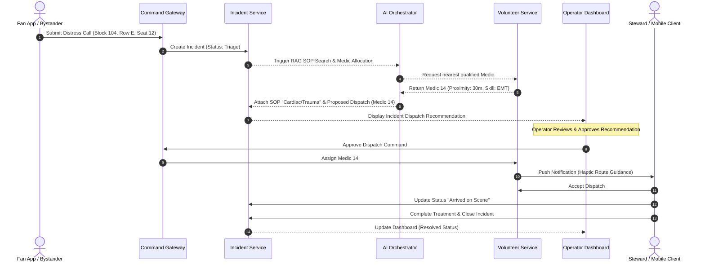
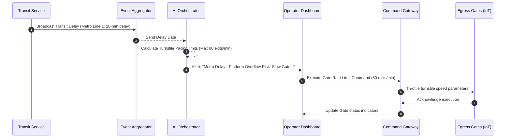
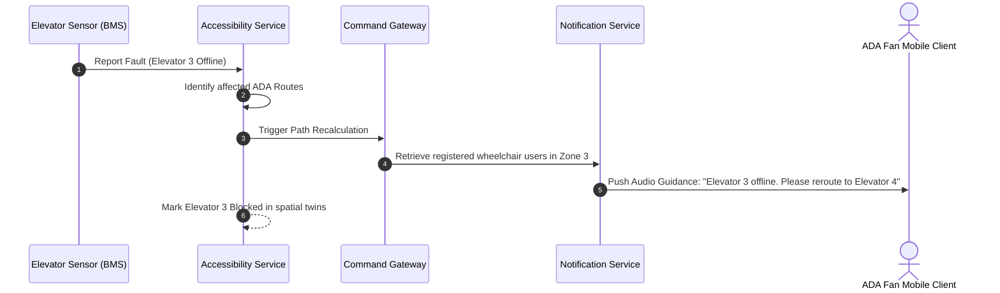
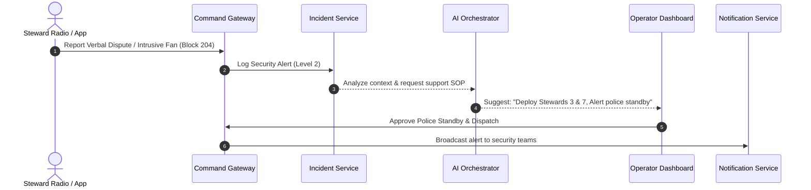
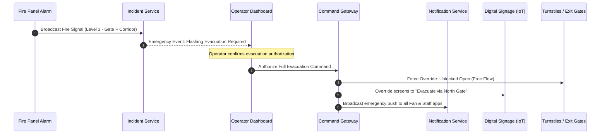

# Aegis Smart Stadium OS: Phase 10 - Sequence Diagrams

This document contains Mermaid sequence diagrams detailing the operational execution flow for all major event workflows.

---

## 1. Medical Incident Workflow

---

## 2. Transit Delay & Egress Pacing Workflow

---

## 3. Accessibility Blockage Workflow

---

## 4. Security Threat Workflow

---

## 5. Stadium Evacuation Workflow

