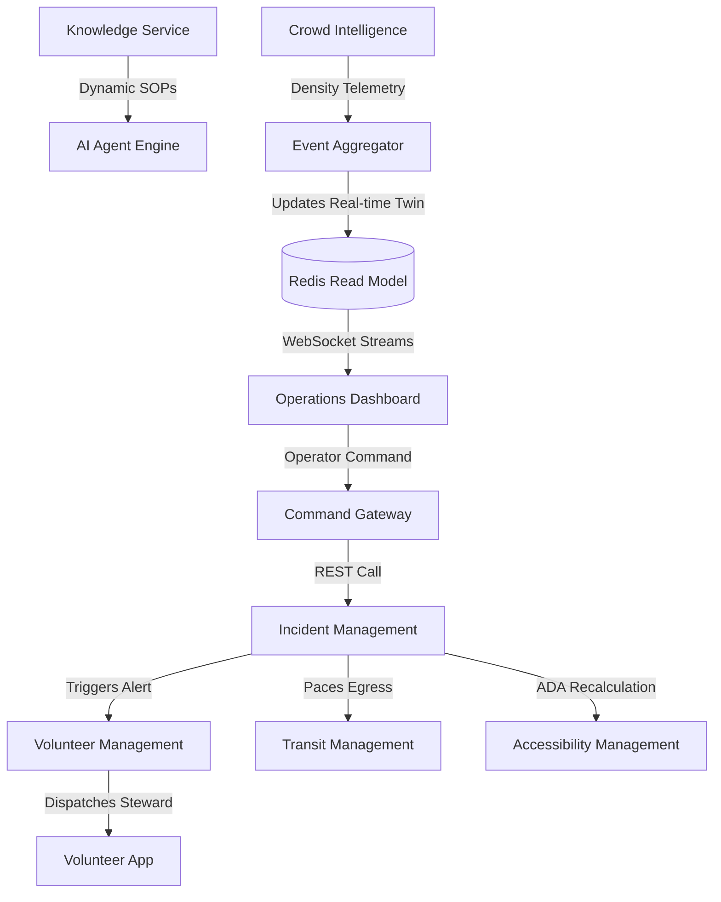

# Aegis Smart Stadium OS: Phase 10 - System Design & Interaction Flow

This document details how every domain service communicates within the Smart Stadium ecosystem and outlines the specific protocols used for each interaction pattern.

---

## 1. System Interaction Flow

The Command Center acts as the coordinator across the following microservices:
- **Knowledge Service** (Retrieval, rulebooks, venue layouts)
- **Crowd Intelligence** (Perimeters, gate sensors, camera streams)
- **Incident Management** (Security incidents, medical alerts, fire panels)
- **Volunteer Management** (Steward tracking, active shifts)
- **Transit Management** (Shuttles, parking metrics, municipal train links)
- **Accessibility Management** (Accessible routes, ADA compliance)
- **AI Agent Ecosystem** (Multi-agent orchestration and reasoning)

---

## 2. Dynamic Request Flows

### 2.1 Request Flow (Synchronous Command)
1. **Trigger**: Operator clicks "Dispatch Shuttle 5" on the dashboard.
2. **Gateway API**: Dashboard POSTs `/api/v1/commands/dispatch-shuttle` to the Command Gateway.
3. **Authentication**: Gateway validates JWT and ensures the operator has the `Transit:Dispatch` permission.
4. **Validation**: The gateway validates the request payload using Pydantic.
5. **Downstream REST Call**: The gateway forwards the command synchronously via HTTP REST to the `Transit Management Service`.
6. **Response**: Transit Service reserves Shuttle 5, posts a confirmation message, and returns `202 Accepted` to the Dashboard.

### 2.2 Event Flow (Asynchronous Telemetry)
1. **Trigger**: An edge camera detects a density threshold breach (e.g., >4 people/m² at Gate C).
2. **Publish**: The Crowd Intelligence Service publishes a `CrowdDensityThresholdBreached` event to Kafka on the `crowd.density.v1` topic.
3. **Consumer Ingestion**: The `Event Aggregator` and `Incident Management Service` consume the event.
4. **Incident Auto-Creation**: The `Incident Management Service` automatically creates a Level 1 Incident and inserts it into PostgreSQL.
5. **Dashboard Push**: The `Event Aggregator` updates the Redis materialized view and triggers a Redis Pub/Sub message. The WebSocket Gateway broadcasts the new incident to all subscribed Operator dashboards in real-time.

### 2.3 Read Flow (Dashboard Query)
1. **Trigger**: The Operator dashboard loads or requests historical reports.
2. **Cache Check**: The API gateway queries Redis for cached read models (e.g., `dashboard:widgets:summary`).
3. **Cache Hit**: Returns data to UI within `< 10ms`.
4. **Cache Miss**: The gateway queries the Aggregation Database (read-replica PostgreSQL) directly using optimized indexes, caches the result in Redis with a 5-second TTL, and returns the response.

### 2.4 Write Flow (State Mutation)
1. **Trigger**: Operator logs a manual incident note.
2. **DB Write**: Command API writes the note to the primary database with ACID transaction boundaries.
3. **CDC Event**: Debezium/Kafka Connect captures the database write and publishes an `IncidentUpdated` event to Kafka.
4. **Read Model Refresh**: Aggregator consumes the event, updates the read model in Redis, and pushes updates via WebSockets.

---

## 3. Service-to-Service Communication Guidelines

To guarantee low latency and reliability, communication patterns are strictly defined:

| Pattern | Protocol | Source | Target | When to Use |
| :--- | :--- | :--- | :--- | :--- |
| **REST (HTTP/JSON)** | Synchronous | API Gateway | Microservices | When immediate confirmation is required (e.g., user login, configuration update). |
| **Kafka (Protobuf)** | Asynchronous | Microservices | Microservices | For all business events, telemetry streaming, audit trails, and inter-service state propagation. |
| **Redis Pub/Sub** | Pub/Sub | Aggregator | WebSockets | To route real-time telemetry updates from backend worker nodes to UI gateway instances. |
| **Redis Cache** | Key-Value | API Gateway | Redis | For short-term state caching (SSO sessions, rate-limit keys, static configuration parameters). |
| **Direct DB** | SQL (TCP) | Microservices | PostgreSQL | Restricted exclusively to a service's own database schema. Cross-service database access is strictly banned. |
