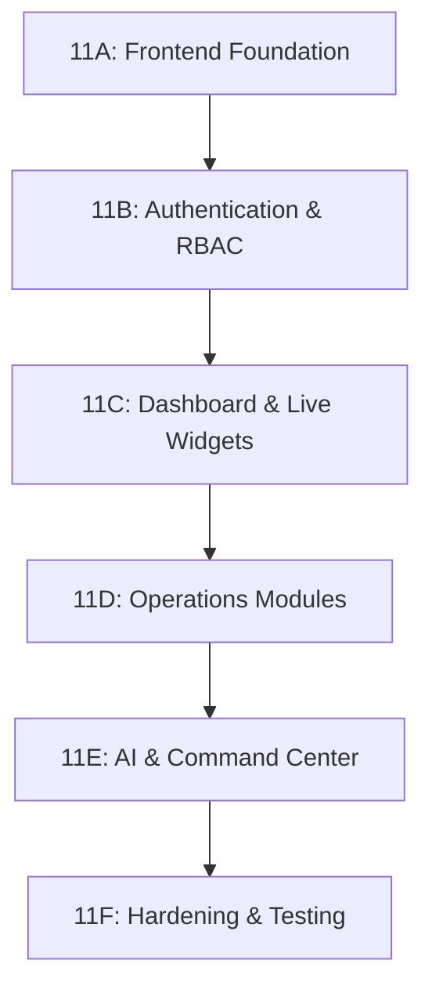

# Phase 11 Implementation Plan: Operations Command Center Frontend

This document outlines the master implementation plan for building the COMPLETE frontend client of the Aegis Smart Stadium OS. The frontend is designed to act as a mission-critical command center (NASA/Airport Operations style) integrated with the backend services built in Phases 1–10.

---

## Phase Division & Execution Roadmap

### Phase 11A: Frontend Foundation
*   **Goal**: Establish a production-grade React/Next.js foundation with all dev tools, design system tokens, configurations, and baseline UI layout.
*   **Tasks**:
    *   Initialize Next.js project inside `frontend/` (using App Router, TypeScript, Tailwind CSS, Shadcn UI).
    *   Set up absolute path aliases and folders matching `FRONTEND_FOLDER_STRUCTURE.md`.
    *   Configure TanStack Query (React Query) and Zustand.
    *   Configure Axios global instance with automatic bearer tokens and base headers.
    *   Establish CSS design tokens for Dark/Light mode (default: Dark).
    *   Implement global layout containing left navigation, collapsible sidebar, top operational status bar, and user profile panel.
    *   Build skeleton load indicators, error boundaries, and custom loading states.

### Phase 11B: Authentication & RBAC
*   **Goal**: Secure client-side application structure mapping roles and permissions to UI elements.
*   **Tasks**:
    *   Build interactive login, registration, and password recovery pages.
    *   Integrate credentials API with local storage/session storage token management.
    *   Configure Axios response interceptors for silent token refresh via `/auth/refresh` on `401 Unauthorized`.
    *   Define role types (`Steward`, `Operator`, `Administrator`, `OperationsManager`) and scopes (`transit:read`, `transit:write`, `accessibility:read`, etc.).
    *   Build route-level middleware guards redirecting unauthenticated or unauthorized users.
    *   Create permission-aware components (e.g. `<ProtectedElement roles={['Administrator']}>`).

### Phase 11C: Dashboard & Live Widgets
*   **Goal**: Bring the command center dashboard alive using real-time WebSockets and key performance indicators.
*   **Tasks**:
    *   Build the core state store for active stadium metrics.
    *   Connect client to backend WebSockets routing:
        *   `/ws/dashboard/metrics` -> Redis, Database, Kafka, CPU, RAM metrics.
        *   `/ws/dashboard/alerts` -> Live systems alarms.
    *   Create interactive UI components:
        *   System health monitor card (Redis, Kafka, DB status).
        *   Resource utilization bars (CPU, RAM).
        *   Event telemetry cards (Active Users, Active Volunteers, Active Incidents).
        *   Live incident ticker/timeline.

### Phase 11D: Operations Modules
*   **Goal**: Build detailed operational dashboards for stadium personnel.
*   **Tasks**:
    *   **Crowd Module**: Density level indicators, Zone estimated counts, and heatmap overlays.
    *   **Incident Module**: Incident creation flow, detailed ticket card views, commenting thread, attachment uploads, and priority updates.
    *   **Volunteer Module**: Volunteer registry, skill certifications list, shifts tracking, and availability roster.
    *   **Transit Module**: Route schedules table, active shuttle tracking, and Egress pacing controls.
    *   **Accessibility Module**: Active venue barriers overlay, elevator/escalator operational status indicators.

### Phase 11E: AI & Command Center
*   **Goal**: Orchestrate advanced AI predictions and approval command queues.
*   **Tasks**:
    *   **AI Panel**: Risk assessment speedometer widget, predictive recommendations, confidence meters, evidence logs, and accept/reject/override feedback handlers.
    *   **Command Queue**: Table showing pending, running, completed, and rejected commands; two-person verification approval/rejection modal.
    *   **AI Copilot**: Collapsible floating chat bubble connecting to `/ai/query` providing RAG-supported stadium operations advice.

### Phase 11F: Production Hardening & Testing
*   **Goal**: Validate correctness, verify performance, and ensure reliability.
*   **Tasks**:
    *   Write component test suites using Vitest and React Testing Library.
    *   Establish end-to-end user flows using Playwright.
    *   Audit page load speeds, resource sizing, and code splitting/lazy loading.
    *   Configure production Dockerfile for containerized deployment.
