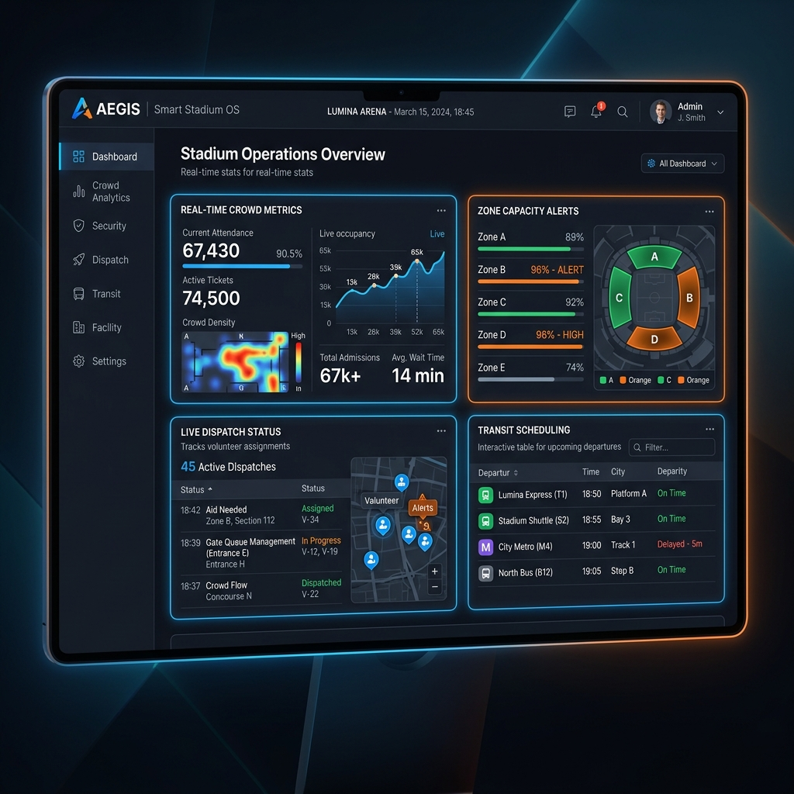
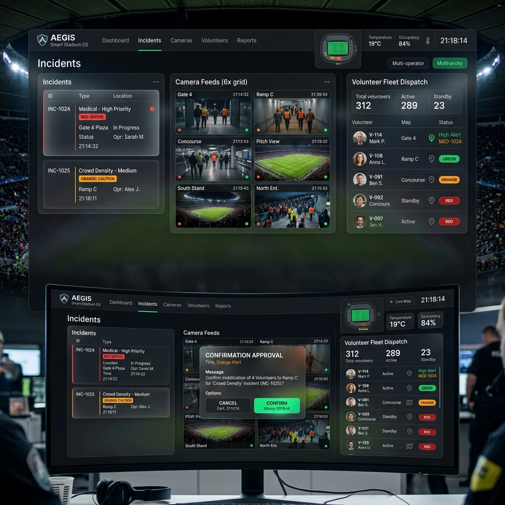
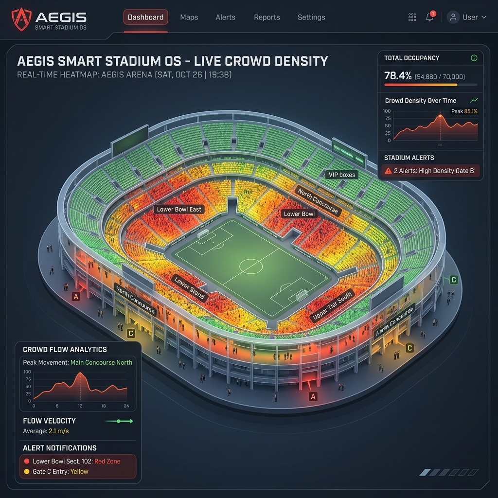

# 🏟️ Aegis Smart Stadium OS

[](https://github.com/Parth1020738/-Stadium-OS)
[](https://github.com/Parth1020738/-Stadium-OS)
[](./LICENSE)
[](https://github.com/Parth1020738/-Stadium-OS/releases/tag/v1.0.0)

Aegis Smart Stadium OS is an enterprise-grade, high-concurrency event telemetry and coordination platform designed for automated crowd safety, security dispatch, and real-time operations inside large stadium venues. Built using an edge-to-cloud model, it features live zone density analysis, volunteer scheduling, fleet dispatch coordination, accessibility routing, and AI-driven playbook suggestions.

---

## 📖 1. Project Overview

Aegis Smart Stadium OS serves as a centralized operating system for stadium staff, security personnel, volunteers, and emergency responders during large-scale sports and entertainment events. Under extreme concurrency, Aegis integrates real-time telemetry from video analysis nodes (mocked), ticket turnstiles, and mobile user coordinates to deliver a single pane of glass for stadium safety.

### ⚠️ Problem Statement
Large sports and concert venues often struggle with operational fragmentation during events:
1. **Crowd Congestion**: Bottlenecks at gates and concourses create severe evacuation and crushing risks.
2. **Delayed Dispatch**: Security and medical responders lose critical minutes due to uncoordinated dispatch channels.
3. **Accessibility Obstacles**: Disabled attendees face sudden route closures or lack real-time transit accessibility routing.
4. **Information Silos**: Command centers make high-stakes decisions without unified event logs or real-time standard operating procedures (SOPs).

### 🏆 Challenge Vertical
Aegis aligns directly with the **Smart Infrastructure, Crowd Safety, and Real-Time Event Management** vertical. It leverages high-performance backend pipelines, real-time reactive frontend frameworks, and GenAI recommendations to establish a robust framework for safer and more accessible smart stadiums.

---

## 🏗️ 2. Platform Architecture

Aegis OS uses a decoupled, event-driven service-oriented architecture:

```
                            +-----------------------------------+
                            |        Next.js Frontend           |
                            |       (React 19 & Zustand)        |
                            +-----------------+-----------------+
                                              |
                                              | (REST / WebSockets)
                                              v
                            +-----------------+-----------------+
                            |         API Gateway               |
                            |       (NestJS Proxy Gateway)      |
                            +-----------------+-----------------+
                                              |
                                              | (FastAPI Service Layer)
                                              v
                            +-----------------+-----------------+
                            |         FastAPI Backend           |
                            |       (Python 3.12 / Async)       |
                            +----+------------+------------+----+
                                 |            |            |
                    (SQLAlchemy) |            | (Redis)    | (Kafka Events)
                                 v            v            v
                            +----+----+  +----+----+  +----+----+
                            | SQLite  |  |  Redis  |  |  Kafka  |
                            | (Aegis) |  |  Cache  |  | Broker  |
                            +---------+  +---------+  +---------+
```

### 🖥️ Frontend
- **Framework**: Next.js 16 (App Router) using React 19.
- **State Management**: Zustand for lightweight, high-performance global store synchronization.
- **Styling**: TailwindCSS 4 and CSS Variables for custom themes.
- **Client Networking**: Axios for REST, native WebSockets for telemetry streams.

### ⚙️ Backend
- **Framework**: FastAPI (Python 3.12) with fully asynchronous database sessions.
- **Database ORM**: SQLAlchemy with Alembic migration schema.
- **Database Engine**: SQLite (default local) or PostgreSQL with `pgvector` for vector embedding matching.
- **Caching**: Redis for session invalidation and telemetry metadata store.

### 🧠 GenAI & Copilot Capabilities
- **LLM Model**: Google Gemini 2.5 Flash (`gemini-1.5-flash`).
- **AI Features**:
  - **Real-Time Streaming Responses**: Instant SOP lookup and queries.
  - **Multi-Language Translation**: Localized guides for international staff (EN, ES, FR, PT, AR).
  - **Explainable Recommendations**: confidence scores and risk analysis.
  - **Workflow Execution**: Actionable step suggestions requiring supervisor confirmation.
  - **Mock AI Mode**: Production-ready fallback for demo/offline scenarios.

### 🛡️ Command Center & Security Guards
- **Multi-Operator Approvals**: Dual-signature confirmation gates for critical operations (e.g., dispatching emergency services, structural lockdowns).
- **Concurrency Guards**: Optimistic locking schemes prevent race conditions when multiple dispatchers assign resources simultaneously.

---

## ✨ 3. Features

- **Real-Time Crowd Density Heatmaps**: Live occupancy updates for all stadium zones with automatic congestion alert indicators.
- **Volunteer Rostering & Shift Management**: Automated dispatch, attendance validation, and shift logs.
- **Transit & Dispatch Optimization**: Real-time tracking of stadium golf carts, shuttle vans, and medical responders.
- **Accessibility Navigation Portal**: Elevators/ramp status tracking and customized wheelchair-accessible routing.
- **AI-Copilot Emergency SOPs**: Real-time suggestions for responder teams based on historical incident reports and playbooks.
- **Command & Control Operations Room**: Consolidated dashboard showing pending alerts, active dispatches, system health metrics, and manual overrides.

---

## 📁 4. Folder Structure

```
├── ai/                       # Local AI model configurations and mock playbooks
├── alembic/                  # Database migration schemas
├── api-gateway/              # NestJS microservices proxy API Gateway
├── backend/                  # FastAPI Backend API Server
│   ├── app/
│   │   ├── api/              # API Route endpoints (v1)
│   │   ├── core/             # Configuration & security files
│   │   ├── models/           # SQLAlchemy DB models
│   │   ├── repositories/     # Database operations repository pattern
│   │   └── services/         # Core business logic processing
│   └── requirements.txt      # Python dependencies manifest
├── charts/                   # Helm charts for Kubernetes deployments
├── docs/                     # System architecture & walkthrough screenshots
│   ├── features/             # Feature-specific documentation
│   ├── research/             # System research drafts (DIM, DKB, GCM, PPM)
│   └── screenshots/          # Embedded UI mockup images
├── frontend/                 # Next.js Frontend Dashboard Client
│   ├── __tests__/            # Frontend unit and E2E test suites
│   ├── src/
│   │   ├── app/              # Next.js Page components
│   │   ├── components/       # Reusable layout UI blocks
│   │   └── store/            # Zustand global stores
│   └── package.json          # Node dependencies manifest
├── k8s/                      # Kubernetes YAML manifest templates
├── mobile/                   # React Native / Expo mobile app
├── scripts/                  # DevOps build, reset, and deploy scripts
│   ├── health_check.py       # Health checking utility
│   └── verify_environment.py # Setup environment verifier
└── tests/                    # Backend pytest sequential test suites
```

---

## 🚀 5. Quick Start & Installation

### 5.1 Prerequisites
- **Python**: v3.11 or v3.12
- **Node.js**: v20.x or higher
- **Package Managers**: `pnpm` (preferred) or `npm`
- **Docker**: Desktop / Compose (optional)

### 5.2 Environment Setup
Create a `.env` file in the root directory (based on `.env.example`):
```env
# Core Configuration
NODE_ENV=development
PORT=3000

# Databases
DATABASE_URL=sqlite:///./aegis.db
REDIS_URL=redis://localhost:6379/0
KAFKA_BOOTSTRAP_SERVERS=localhost:9092

# Security
JWT_SECRET=super-secure-jwt-secret-key-32-chars-long
JWT_ALGORITHM=HS256

# AI Configuration
ENABLE_MOCK_AI=true
AI_PROVIDER=mock
USE_REAL_GEMINI=false
GEMINI_API_KEY=MOCK_MODE
```

---

## 💻 6. Running Locally

### 6.1 Backend API Server Setup
```bash
# Navigate to backend and setup virtual environment
cd backend
python -m venv .venv
source .venv/bin/activate  # Windows: .venv\Scripts\activate

# Install requirements
pip install -r requirements.txt

# Run migrations to initialize local database
alembic upgrade head

# Start FastAPI dev server
uvicorn app.main:app --host 0.0.0.0 --port 8000 --reload
```

### 6.2 Frontend Dashboard Setup
```bash
# Navigate to frontend folder
cd frontend

# Install package dependencies
pnpm install

# Build NextJS production layout
pnpm run build

# Start dev server locally
pnpm run dev
```
Open [http://localhost:3000](http://localhost:3000) to view the application dashboard.

### 6.3 Run with Docker Compose
```bash
# Start all services (Database, Redis, API Server, Gateway, NextJS Client)
docker-compose up -d
```

### 6.4 Kubernetes Deployment
Deploy the Aegis stack to your K8s cluster using Helm:
```bash
# Validate chart templates
helm lint charts/aegis-os/

# Deploy chart release
helm install aegis-release charts/aegis-os/
```

---

## 🧪 7. Testing & QA Verification

The repository contains end-to-end and unit test coverages for both backend and frontend layers:

```bash
# Execute Backend tests
cd backend
pytest

# Execute Frontend unit tests (Vitest)
cd frontend
npm run test

# Run typescript linter verification
npm run lint
```

---

## 🖥️ 8. Interface Previews

### 📊 System Operations Dashboard
Live crowd safety charts, alert queues, shuttle dispatches, and infrastructure metrics are visualised in real-time.


### 🚨 Command Approval Console
Multi-operator confirmation paths protect stadium zones, dispatch units, and manage event overrides.


### 🔥 Stadium Crowd Heatmap
3D mapping indicators show congestion levels and path hazards across all stadium sectors.


---

## 🗺️ 9. API Overview & Endpoints

Aegis Backend exposes REST and WebSocket endpoints for high-throughput messaging and telemetry updates:

| Endpoint | Method | Description |
| :--- | :---: | :--- |
| `/api/v1/auth/login` | `POST` | Authenticates operator and returns JWT |
| `/api/v1/incidents` | `GET` | Retrieves active safety alerts |
| `/api/v1/incidents` | `POST` | Creates a new security incident report |
| `/api/v1/volunteers` | `GET` | Returns list of available event volunteers |
| `/api/v1/copilot/chat`| `POST` | Interacts with Gemini Copilot for SOP execution |
| `/api/v1/ws/telemetry` | `WS` | WebSocket stream for live density heatmaps |

---

## 📖 10. Judge Demo Guide

### FIFA Demo Walkthrough
1. **Login** → Use demo credentials: `operator@stadium.aegis.com` / `password123`
2. **Dashboard** → View live crowd telemetry and system status.
3. **Click START FIFA DEMO** → Automatic simulation begins.
4. **Observe** → Mission Control updates through 9 match scenarios.
5. **Open Copilot** → Ask any operational question.
6. **Approve Commands** → Two-person authentication flow demonstrated.

### Demo Scenarios
| # | Scenario | Risk Level | Key Actions |
|---|----------|-----------|-------------|
| 1 | Pre-Match | Low | Gate operations |
| 2 | Kickoff | Medium | Crowd monitoring |
| 3 | Goal | Medium | Vibration analysis |
| 4 | Halftime | Medium | Concourse flow |
| 5 | Crowd Surge | High | Gate D bottleneck |
| 6 | Medical Emergency | High | First aid dispatch |
| 7 | Power Failure | High | Elevator failure |
| 8 | Security Alert | Critical | Lockdown procedures |
| 9 | Evacuation | Critical | Emergency protocols |

---

## 🔮 11. Future Scope
- **Edge Camera Integration**: Deploy physical RTSP pipelines and run low-latency YOLO models for real-time occupant estimation.
- **Offline Mesh Networks**: Support Bluetooth Low Energy (BLE) fallback beacons for emergency dispatches when stadium cell networks crash.
- **Dynamic Evacuation Routing**: Implement path-finding algorithms to dynamically redirect crowd traffic away from hazard zones.

---

## 📄 12. License & Authors
- **License**: MIT License  
- **Author**: Parth Patel (Parth1020738)
