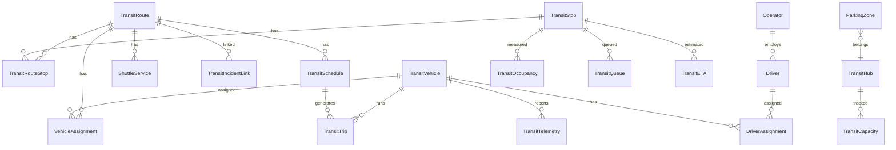

# Transit Management Service — Phase 8

> Aegis Smart Stadium OS — Transit Management Module

---

## Table of Contents

1. [Overview](#overview)
2. [Architecture](#architecture)
3. [Data Model](#data-model)
4. [API Reference](#api-reference)
5. [Security & RBAC](#security--rbac)
6. [Business Rules](#business-rules)
7. [Configuration](#configuration)
8. [Testing](#testing)
9. [Deployment](#deployment)

---

## Overview

The Transit Management Service provides real-time shuttle, bus, metro, and light-rail coordination for large-scale stadium events. It manages routes, stops, vehicles, drivers, schedules, telemetry, passenger capacity, parking zones, egress pacing, and transit alerts — all integrated into the Aegis Smart Stadium OS platform.

### Key Capabilities

| Capability | Description |
|---|---|
| Route Management | CRUD for transit routes with type/status filtering and search |
| Stop Management | Geolocated transit stops with M2M route associations |
| Vehicle Fleet | Vehicle registration, capacity tracking, maintenance status |
| Driver Management | Driver licensing, certification, and status tracking |
| Schedule Management | Route scheduling with overlap detection and conflict resolution |
| Vehicle Assignment | Assign vehicles to routes with capacity and availability validation |
| Driver Assignment | Assign drivers to vehicles with license/certification verification |
| Telemetry Ingestion | Real-time GPS, speed, heading, and fuel level telemetry |
| Capacity & Occupancy | Hub/stop-level passenger load tracking with threshold alerts |
| Parking Zones | Parking zone management with occupancy and availability tracking |
| Egress Pacing | Post-event crowd flow management with graduated release |
| Transit Alerts | Alert ingestion with severity classification and Kafka integration |
| Statistics Dashboard | Aggregate fleet metrics (active vehicles, routes, capacity) |

---

## Architecture

### Clean Architecture Layers

```
┌──────────────────────────────────────────────────────────────┐
│                    REST API Layer                             │
│  backend/app/api/v1/endpoints/transit.py                     │
│  FastAPI Router · JWT Auth · RBAC Scope Checking             │
├──────────────────────────────────────────────────────────────┤
│                  Business Service Layer                       │
│  backend/app/services/transit_service.py                     │
│  RouteService · VehicleService · DriverService               │
│  ScheduleService · AssignmentService · TelemetryService      │
│  CapacityService · ETAService · ParkingService               │
│  QueueService · AuditService · TransitService                │
├──────────────────────────────────────────────────────────────┤
│                   Repository Layer                            │
│  backend/app/repositories/transit_repository.py              │
│  RouteRepository · StopRepository · VehicleRepository        │
│  DriverRepository · TripRepository · ScheduleRepository      │
│  TelemetryRepository · CapacityRepository                    │
│  ParkingRepository · AuditRepository                         │
├──────────────────────────────────────────────────────────────┤
│                    Data Model Layer                           │
│  backend/app/models/transit.py                               │
│  20 SQLAlchemy ORM Models · Alembic Migrations               │
└──────────────────────────────────────────────────────────────┘
```

### Design Principles

- **SOLID** — Single responsibility per service/repository class
- **Repository Pattern** — Data access isolated from business logic
- **Dependency Injection** — Services receive sessions via constructor
- **Async I/O** — All database operations use SQLAlchemy async sessions
- **Optimistic Concurrency** — `version_id` column on every entity
- **Soft Deletes** — `is_deleted` flag, never hard-delete records
- **Audit Trail** — `created_at`, `updated_at`, `created_by`, `updated_by` on all entities

---

## Data Model

### Entity Relationship Diagram



### Model Reference

| Model | Table | Description |
|---|---|---|
| `TransitRoute` | `transit_routes` | Route definitions (Bus, Metro, LightRail, Shuttle) |
| `TransitStop` | `transit_stops` | Geolocated transit stops |
| `TransitRouteStop` | `transit_route_stops` | M2M association with stop_sequence |
| `TransitVehicle` | `transit_vehicles` | Fleet vehicles with capacity |
| `Driver` | `transit_drivers` | Licensed transit drivers |
| `Operator` | `transit_operators` | Transit operating companies |
| `TransitHub` | `transit_hubs` | Major transit interchange hubs |
| `ParkingZone` | `transit_parking_zones` | Stadium parking areas |
| `ShuttleService` | `transit_shuttle_services` | Dedicated shuttle services |
| `VehicleAssignment` | `transit_vehicle_assignments` | Vehicle-to-route assignments |
| `DriverAssignment` | `transit_driver_assignments` | Driver-to-vehicle assignments |
| `TransitSchedule` | `transit_schedules` | Route timetables |
| `TransitTrip` | `transit_trips` | Individual trip instances |
| `TransitTelemetry` | `transit_telemetry` | Real-time vehicle telemetry |
| `TransitDelay` | `transit_delays` | Delay records with reasons |
| `TransitCapacity` | `transit_capacity` | Hub capacity snapshots |
| `TransitOccupancy` | `transit_occupancy` | Stop occupancy levels |
| `TransitQueue` | `transit_queues` | Passenger queue tracking |
| `TransitETA` | `transit_etas` | Estimated arrival times |
| `TransitIncidentLink` | `transit_incident_links` | Cross-references to incident reports |
| `TransitAudit` | `transit_audit` | Immutable audit trail |

### Standard Columns (All Models)

| Column | Type | Description |
|---|---|---|
| `id` | `Integer` | Auto-increment primary key |
| `created_at` | `DateTime` | UTC creation timestamp |
| `updated_at` | `DateTime` | UTC last-modified timestamp |
| `created_by` | `Integer` | User ID who created the record |
| `updated_by` | `Integer` | User ID who last modified |
| `is_deleted` | `Boolean` | Soft delete flag (default `false`) |
| `version_id` | `Integer` | Optimistic concurrency version |

---

## API Reference

### Base URL

```
/api/v1/transit
```

### Endpoints

#### Routes

| Method | Path | Scope | Description |
|---|---|---|---|
| `GET` | `/routes` | `transit:read` | List routes with filtering, search, and pagination |
| `POST` | `/routes` | `transit:write` | Create a new transit route |

#### Hub Occupancy

| Method | Path | Scope | Description |
|---|---|---|---|
| `GET` | `/hubs/{hub_id}/occupancy` | `transit:read` | Get real-time hub occupancy data |

#### Alerts

| Method | Path | Scope | Description |
|---|---|---|---|
| `POST` | `/alerts` | `transit:write` | Ingest a transit alert (publishes to Kafka) |

#### Egress Pacing

| Method | Path | Scope | Description |
|---|---|---|---|
| `POST` | `/egress-pacing` | `transit:pacing` | Apply egress pacing for post-event crowd flow |

#### Vehicles

| Method | Path | Scope | Description |
|---|---|---|---|
| `POST` | `/vehicles` | `transit:write` | Register a new vehicle |

#### Assignments

| Method | Path | Scope | Description |
|---|---|---|---|
| `POST` | `/assignments/vehicle` | `transit:write` | Assign vehicle to route |
| `POST` | `/assignments/driver` | `transit:write` | Assign driver to vehicle |

#### Schedules

| Method | Path | Scope | Description |
|---|---|---|---|
| `POST` | `/schedules` | `transit:write` | Create a route schedule |

#### Telemetry

| Method | Path | Scope | Description |
|---|---|---|---|
| `POST` | `/telemetry` | `transit:write` | Record vehicle telemetry data |

#### Statistics

| Method | Path | Scope | Description |
|---|---|---|---|
| `GET` | `/statistics` | `transit:read` | Aggregate fleet statistics |

### Request/Response Examples

#### Create Route

```json
POST /api/v1/transit/routes
Authorization: Bearer <jwt_token>

{
  "name": "Stadium Express Line A",
  "route_code": "SEL-A",
  "route_type": "Bus",
  "description": "Express shuttle from Central Station to Gate A"
}
```

**Response** (201):
```json
{
  "status": "success",
  "data": {
    "id": 1,
    "name": "Stadium Express Line A",
    "route_code": "SEL-A",
    "route_type": "Bus",
    "status": "Active",
    "description": "Express shuttle from Central Station to Gate A"
  }
}
```

#### Ingest Transit Alert

```json
POST /api/v1/transit/alerts
Authorization: Bearer <jwt_token>

{
  "alert_type": "Delay",
  "severity": "High",
  "message": "Route SEL-A delayed 15 min due to traffic congestion",
  "route_id": 1,
  "correlation_id": "evt-2026-final-001"
}
```

**Response** (200):
```json
{
  "status": "success",
  "data": {
    "alert_id": "trn-alert-a1b2c3d4",
    "processed": true,
    "kafka_published": true
  }
}
```

#### Egress Pacing

```json
POST /api/v1/transit/egress-pacing
Authorization: Bearer <jwt_token>

{
  "zone_id": "north-gate",
  "target_flow_rate": 500,
  "duration_minutes": 30,
  "strategy": "graduated",
  "correlation_id": "egress-2026-final-001"
}
```

**Response** (200):
```json
{
  "status": "success",
  "data": {
    "pacing_plan_id": "pace-x9y8z7w6",
    "zone_id": "north-gate",
    "target_flow_rate": 500,
    "estimated_clear_time_minutes": 30,
    "strategy": "graduated"
  }
}
```

---

## Security & RBAC

### Authentication

All endpoints require a valid JWT Bearer token in the `Authorization` header.

### Scopes

| Scope | Grants Access To |
|---|---|
| `transit:read` | Route listing, hub occupancy, statistics |
| `transit:write` | Route creation, vehicle registration, assignments, schedules, telemetry, alerts |
| `transit:pacing` | Egress pacing operations |

### Role Bypass

Users with **Admin** or **Staff** roles bypass scope checks and have full access to all transit endpoints.

### Scope Enforcement Flow

```
Request → JWT Validation → Role Check → Scope Check → Endpoint Handler
                              │              │
                              ├─ Admin ──────┤ (bypass)
                              ├─ Staff ──────┤ (bypass)
                              └─ Other ──────┤ (check scopes)
```

---

## Business Rules

| Rule | Description |
|---|---|
| Vehicle Assignment Validation | Vehicles must be `Active` status to be assigned |
| Driver License Verification | Drivers must have valid license numbers |
| Schedule Overlap Detection | New schedules are checked for time conflicts on the same route |
| Capacity Threshold Alerts | Hub occupancy exceeding capacity triggers warnings |
| Parking Zone Limits | Parking assignments respect zone capacity |
| ETA Calculation | Based on distance, average speed, and current conditions |
| Telemetry Validation | GPS coordinates, speed, and fuel levels are range-validated |
| Audit Logging | All create/update/delete operations generate immutable audit records |
| Optimistic Locking | Concurrent updates are rejected if version_id conflicts |
| Soft Delete | Records are never hard-deleted; `is_deleted=True` is set instead |

---

## Configuration

All configuration is read from environment variables:

| Variable | Description | Default |
|---|---|---|
| `DATABASE_URL` | Async database connection string | `sqlite+aiosqlite:///./test.db` |
| `JWT_SECRET` | JWT signing secret key | (required) |
| `JWT_ALGORITHM` | JWT algorithm | `HS256` |
| `KAFKA_BOOTSTRAP_SERVERS` | Kafka broker addresses | `localhost:9092` |
| `KAFKA_TRANSIT_TOPIC` | Kafka topic for transit events | `transit-events` |
| `REDIS_URL` | Redis connection URL | `redis://localhost:6379` |

---

## Testing

### Test Suites

| File | Tests | Coverage |
|---|---|---|
| `test_transit_api.py` | 1 comprehensive flow test | RBAC, scope enforcement, route CRUD, vehicle registration, assignments, schedules, telemetry, statistics, alerts, egress pacing |

### Running Tests

```bash
# Run transit tests only
pytest tests/backend/test_transit_api.py -v

# Run all backend tests (isolated)
python tests/backend/run_tests.py

# Run specific test
pytest tests/backend/test_transit_api.py::test_transit_api_rbac_and_flow -v
```

### Test Results (All Passing)

```
tests/backend/test_ai.py               ✅ PASSED
tests/backend/test_auth.py             ✅ PASSED  (2 tests)
tests/backend/test_crowd.py            ✅ PASSED
tests/backend/test_health.py           ✅ PASSED
tests/backend/test_incidents.py        ✅ PASSED  (13 tests)
tests/backend/test_knowledge.py        ✅ PASSED
tests/backend/test_transit_api.py      ✅ PASSED
tests/backend/test_users.py            ✅ PASSED  (2 tests)
tests/backend/test_volunteer_api.py    ✅ PASSED
tests/backend/test_volunteer_repos.py  ✅ PASSED  (4 tests)
tests/backend/test_volunteer_svc.py    ✅ PASSED  (4 tests)
─────────────────────────────────────────────────
Total: 11/11 suites passing
```

---

## Deployment

### Alembic Migration

The transit models are covered by migration `2026_07_11_2203-46749e37d8f7_add_transit_models.py`.

```bash
# Apply migration
alembic upgrade head

# Rollback
alembic downgrade -1
```

### Kafka Topics

Ensure the following Kafka topics exist before deployment:

```bash
kafka-topics --create --topic transit-events --partitions 3 --replication-factor 2
kafka-topics --create --topic transit-alerts --partitions 3 --replication-factor 2
kafka-topics --create --topic transit-telemetry --partitions 6 --replication-factor 2
```

---

## File Inventory

| File | Purpose |
|---|---|
| `backend/app/models/transit.py` | 20 SQLAlchemy ORM models |
| `backend/app/repositories/transit_repository.py` | 10 repository classes |
| `backend/app/schemas/transit_schemas.py` | Pydantic request/response DTOs |
| `backend/app/services/transit_service.py` | 12 business service classes |
| `backend/app/api/v1/endpoints/transit.py` | 11 FastAPI REST endpoints |
| `backend/app/core/kafka_producer.py` | Kafka event publisher (shared) |
| `tests/backend/test_transit_api.py` | Integration test suite |
| `alembic/versions/..._add_transit_models.py` | Database migration |
