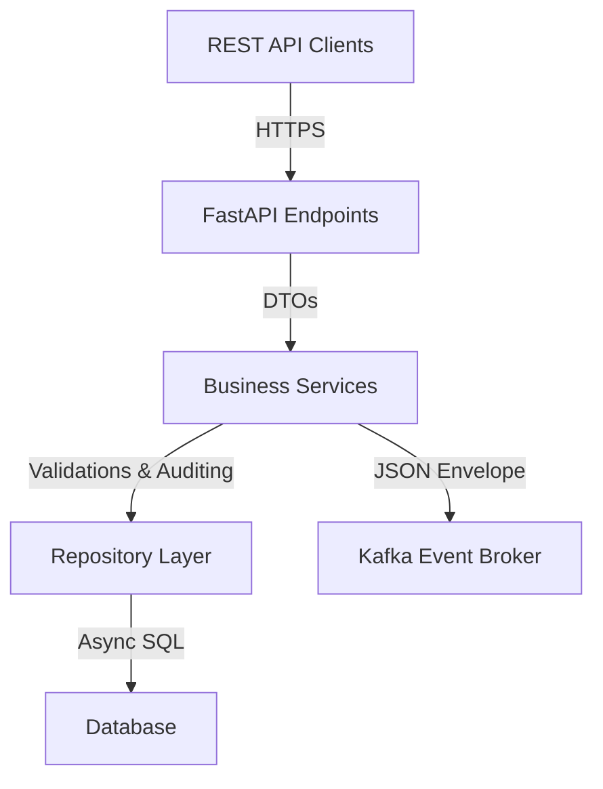
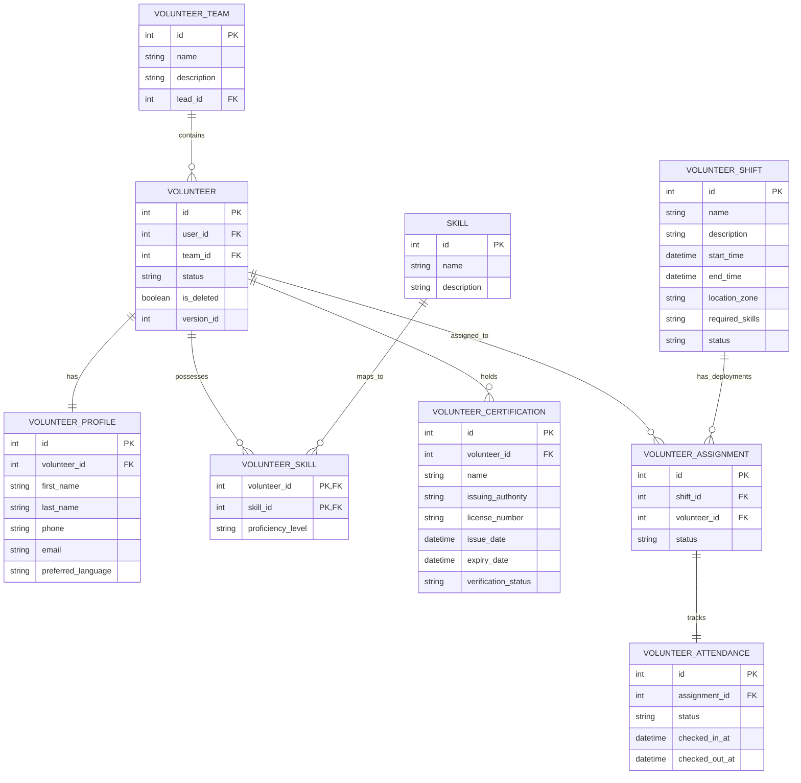

# Aegis Smart Stadium OS - Volunteer Management Service (Phase 7)

This documentation provides details about the architecture, database models, REST APIs, Kafka message payloads, and testing procedures for the Volunteer Management Service (Phase 7).

---

## 1. Architectural Overview

The Volunteer Management Service is an asynchronous, event-driven module designed to handle volunteer onboarding, scheduling, task assignments, and location tracking during tournament operations.

### Component Diagram



---

## 2. Database Models (ER Diagram)

The service relies on 15 core database entities defined in `backend/app/models/volunteer.py`:



---

## 3. REST API Reference

### Endpoints Catalog

#### Volunteers
- `POST /api/v1/volunteers`: Onboard and register new volunteers (Staff only).
- `GET /api/v1/volunteers`: Search and list paginated profiles (Staff only).
- `GET /api/v1/volunteers/{volunteerId}`: Retrieve profile details (Self / Staff).
- `PUT /api/v1/volunteers/{volunteerId}`: Edit profile attributes (Self / Staff).
- `DELETE /api/v1/volunteers/{volunteerId}`: Soft-delete profile (Staff only).
- `POST /api/v1/volunteers/{volunteerId}/status`: Set status (Pending, Active, Inactive, OnShift) (Staff only).
- `POST /api/v1/volunteers/{volunteerId}/skills`: Map required competency (Staff only).
- `POST /api/v1/volunteers/{volunteerId}/certifications`: Upload verified license credentials (Self / Staff).
- `POST /api/v1/volunteers/{volunteerId}/availabilities`: Set weekly schedule (Self / Staff).
- `GET /api/v1/volunteers/statistics`: Retrieve performance summary metrics (Staff only).

#### Shift & Deployment Management
- `POST /api/v1/shifts`: Create new stadium deployment shifts (Staff only).
- `GET /api/v1/shifts`: List scheduled/active shifts (Self / Staff).
- `POST /api/v1/shifts/{shiftId}/assign`: Allocate volunteer to shift (Staff only).
- `POST /api/v1/shifts/assignments/{assignmentId}/reassign`: Shift reassignment (Staff only).
- `POST /api/v1/shifts/assignments/{assignmentId}/check-in`: Log start attendance (Self / Staff).
- `POST /api/v1/shifts/assignments/{assignmentId}/check-out`: Log shift completion (Self / Staff).

---

## 4. Kafka Event Broker Spec

All state modifications trigger Kafka JSON messages containing structured envelopes:

### Core Envelope Format
```json
{
  "schemaVersion": "1.0",
  "correlationId": "corr-80be40a6-16f3-4d43-bb5a-a00632ecf5fa",
  "timestamp": "2026-07-11T13:34:09.415953Z",
  "data": {}
}
```

### Event List
1. `volunteer.created`: Published upon new registration onboarding.
2. `volunteer.updated`: Sent when profile is modified.
3. `volunteer.deleted`: Published upon profile soft deletion.
4. `volunteer.status.changed`: Fires when status transitions (e.g. `Active` -> `OnShift`).
5. `volunteer.shift.created`: Issued when shift scheduler commits a slot.
6. `volunteer.shift.assigned`: Dispatched when a volunteer is scheduled for a shift.
7. `volunteer.shift.reassigned`: Dispatched when assignment is reassigned.
8. `volunteer.checkin`: Published immediately upon attendance check-in.
9. `volunteer.checkout`: Published immediately upon attendance check-out.
10. `volunteer.attendance.updated`: Logs the finalized shift state.

---

## 5. Testing Guide

Run the comprehensive unit & integration test suites using `pytest`:

```bash
# Run all volunteer tests
pytest tests/backend/test_volunteer_repositories.py tests/backend/test_volunteer_services.py tests/backend/test_volunteer_api.py -W ignore
```
