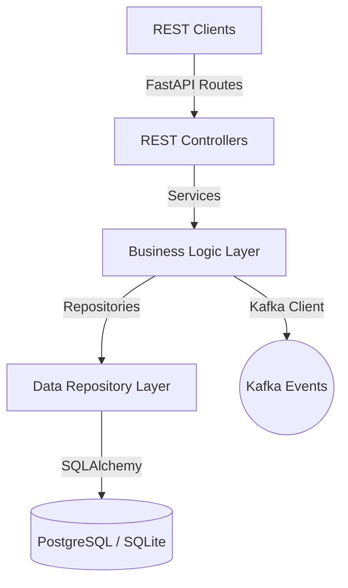

# Aegis Smart Stadium OS - Crowd Intelligence Service (Phase 5)

This service is responsible for real-time crowd dynamics tracking, telemetry parsing, spatial heatmaps, threshold alert monitoring, and camera health auditing.

## Architecture Overview

---

## DB Entities (Models)

1. **`CrowdZone`**: Stadium zone partition metadata.
2. **`ZoneCapacity`**: Max and safe occupancy limits configuration.
3. **`Camera`**: Telemetry capture device reference.
4. **`CameraHealth`**: Connectivity, latency, and FPS history.
5. **`CrowdSnapshot`**: Estimated occupancy telemetry records.
6. **`OccupancyHistory`**: Dynamic zone capacity utilization calculations.
7. **`DensityMetrics`**: Spatial density level limits tracker.
8. **`IngressFlow` / `EgressFlow`**: Zone entry/exit scan-rate statistics.
9. **`HeatmapTile`**: Dynamic 2D spatial distribution grid.
10. **`CrowdThreshold`**: Warning and critical metric limits.
11. **`CrowdAlert`**: System-generated safety alerts.

---

## API Documentation

### Crowd Zones CRUD
* `GET /api/v1/zones/` - List paginated crowd zones.
* `POST /api/v1/zones/` - Create a crowd zone (Admin/OperationsManager only).
* `GET /api/v1/zones/{id}` - Retrieve details of a specific zone.
* `PUT /api/v1/zones/{id}` - Modify zone details (Admin/OperationsManager only).
* `POST /api/v1/zones/{id}/capacity` - Set zone max/safe occupancy limits (Admin/OperationsManager only).

### Cameras CRUD
* `GET /api/v1/cameras/` - List registered cameras.
* `POST /api/v1/cameras/` - Register a camera device (Admin/OperationsManager only).
* `GET /api/v1/cameras/{id}` - Retrieve camera details.
* `PUT /api/v1/cameras/{id}` - Update camera settings (Admin/OperationsManager only).
* `POST /api/v1/cameras/{id}/health` - Record device latency, FPS, and status.

### Crowd Telemetry & Alerts
* `POST /api/v1/crowd/snapshots` - Register snapshot occupancy/density telemetry. Runs threshold checks.
* `PUT /api/v1/crowd/snapshots/{id}?version_id=x` - Update snapshot (protected by concurrency locks).
* `POST /api/v1/crowd/zones/{id}/occupancy` - Post occupancy counts.
* `POST /api/v1/crowd/zones/{id}/density` - Post density statistics.
* `POST /api/v1/crowd/zones/{id}/ingress` - Post turnstile ingress rates.
* `POST /api/v1/crowd/zones/{id}/egress` - Post gate egress rates.
* `POST /api/v1/crowd/zones/{id}/heatmap` - Post spatial 2D heatmap coordinate grids.
* `POST /api/v1/crowd/zones/{id}/thresholds` - Setup warning/critical bounds (Admin/OperationsManager only).
* `GET /api/v1/crowd/zones/{id}/alerts` - Retrieve active warning/critical alerts.
* `POST /api/v1/crowd/alerts/{id}/resolve` - Mark active alert as resolved (Admin/OperationsManager only).

---

## Concurrency Protection (Optimistic Locking)

All telemetry snapshot modifications are protected by native SQLAlchemy versioning. Updating a stale snapshot version raises a `409 Conflict` database exception.

---

## Kafka Real-Time Event Publisher

Emits JSON events to the following topics:
1. `stadium-crowd-snapshots`
2. `stadium-occupancy-updates`
3. `stadium-crowd-capacity-updates`
4. `stadium-camera-health-logs`

### Resilient Mock Fallback Logging
If the Kafka broker cluster is offline or the environment lacks dependencies, the producer automatically falls back to log events locally to files/stdout without crashing.

### Health Monitoring Integration
The producer connectivity status, last error, startup timestamp, state, and broker availability metrics are integrated into the existing endpoint `/api/v1/health`.

