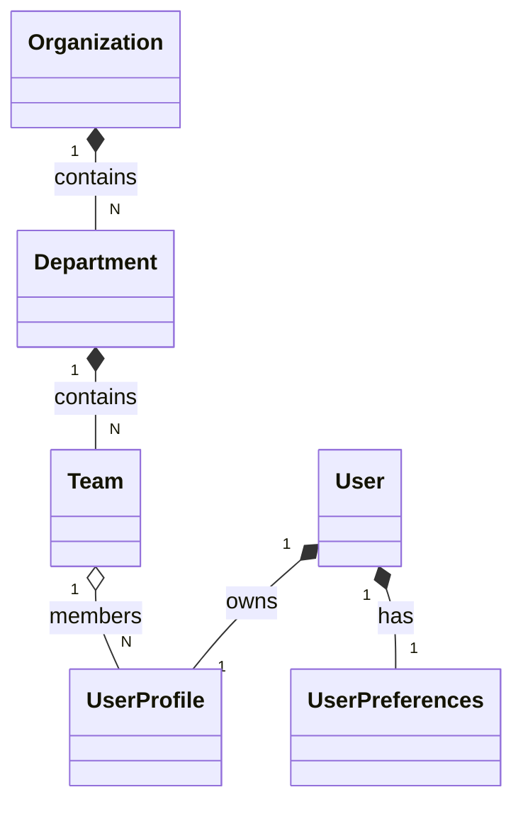

# User Management Service Documentation

The User Management service provides the canonical index for physical actors (stewards, volunteers, general fans, commanders) in the Aegis Smart Stadium OS.

## Domain Model Architecture

The data architecture mapping contains:
- **User**: Authentication parent. Contains status and version attributes.
- **UserProfile**: Personal parameters (first name, last name, phone).
- **UserPreferences**: UI localization settings.
- **Organization / Department / Team**: Organizational layout boundaries mapping staff hierarchies.

## API Operations

- `POST /api/v1/users/` - Register user profile details.
- `GET /api/v1/users/{id}` - Read user profile.
- `PUT /api/v1/users/{id}` - Modify user details. Includes version lock parameters to check concurrent updates.
- `DELETE /api/v1/users/{id}` - Performs soft-delete.
- `POST /api/v1/users/{id}/activate` - Set status to Active (Commander role validation check).
- `POST /api/v1/users/{id}/roles` - Map role assignment.
